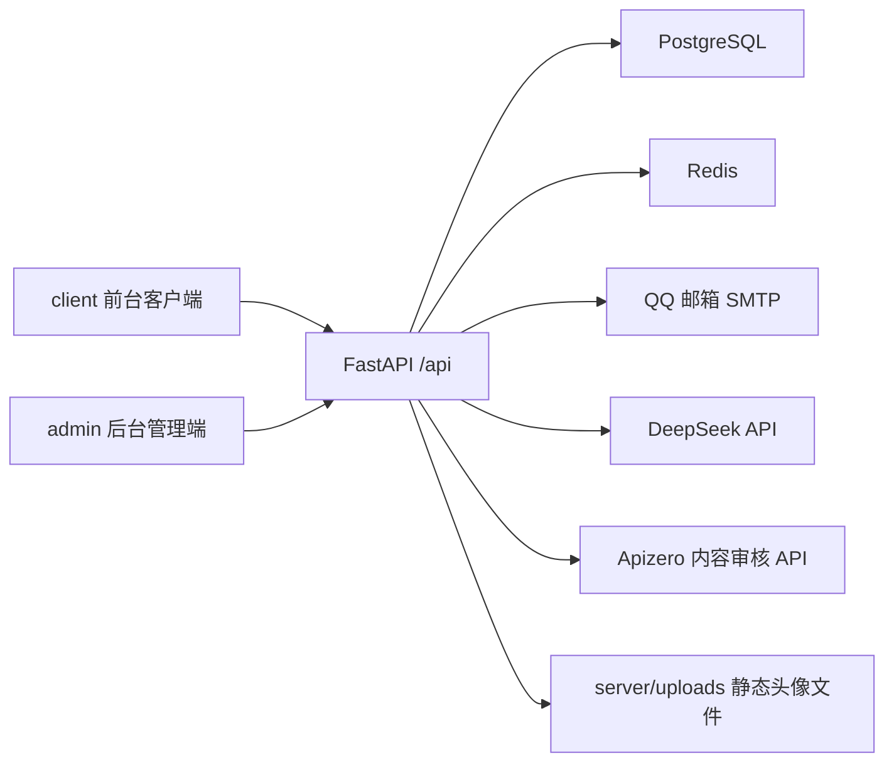
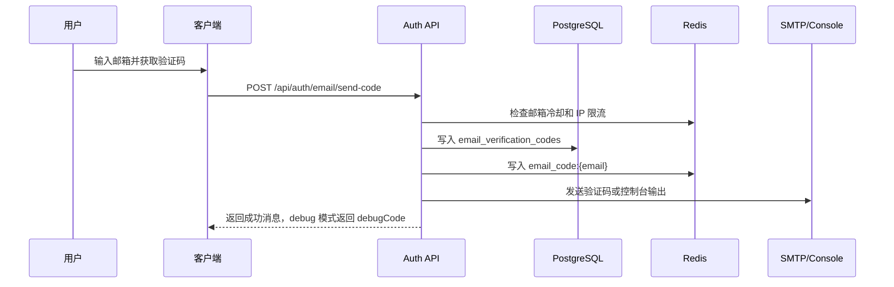
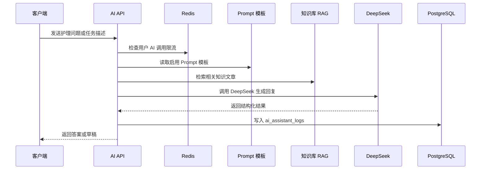
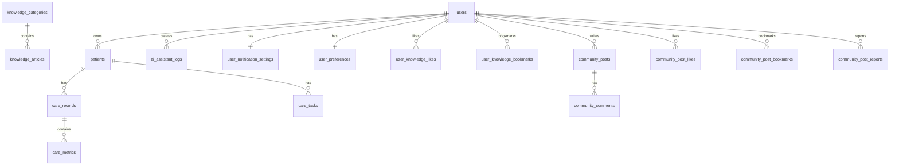

# 医疗照顾者客户端系统项目解析

本文档基于当前仓库代码整理，用于后续毕业设计论文撰写参考。项目名称可表述为“医疗照顾者的客户端系统设计与实现”。系统面向家庭照护者、护理人员和后台内容管理员，提供患者管理、护理记录、护理任务、健康趋势、AI 护理助手、护理知识学习、社区交流和后台运营管理等能力。

## 1. 项目总体定位

本项目是一个前后端分离的护理辅助系统。前台客户端以移动端 Web 体验为主，适合照护者在手机或平板上记录患者护理信息；后台管理端面向管理员，负责用户、社区审核、知识内容、Prompt 模板和 AI 日志管理；服务端提供统一 API、数据持久化、认证授权、缓存限流、邮件验证码、AI 调用和第三方内容审核。

系统核心目标包括：

1. 帮助照护者集中管理多个患者的基础信息、护理记录和护理任务。
2. 通过结构化指标记录血压、血糖、体温、心率、用药、饮食等护理数据。
3. 基于趋势图和 AI 分析辅助照护者理解近期健康变化。
4. 通过 AI 护理助手生成护理记录草稿、任务草稿和护理问答回复。
5. 提供知识学习与社区交流模块，形成护理经验沉淀。
6. 为后台提供数据统计、内容管理、审核与 AI 运维管理能力。

## 2. 技术架构

### 2.1 总体架构

项目采用前后端分离架构，主要由三个部分组成：

| 层级 | 目录 | 技术栈 | 主要职责 |
| --- | --- | --- | --- |
| 客户端 | `client/` | React、TypeScript、Vite、Tailwind CSS、React Router、Recharts、lucide-react | 面向照护者的移动端页面、表单、状态管理、API 调用 |
| 后台管理端 | `admin/` | React、TypeScript，与客户端共用 Vite 构建和 `apiClient` | 管理员登录、统计看板、用户管理、社区审核、知识管理、Prompt 管理、AI 日志 |
| 服务端 | `server/` | FastAPI、SQLAlchemy、Alembic、PostgreSQL、Redis、DeepSeek API、SMTP | 统一 API、业务服务、数据库访问、缓存限流、AI、邮件、内容审核 |

系统运行依赖：

| 组件 | 用途 |
| --- | --- |
| PostgreSQL | 主业务数据库，存储用户、患者、护理记录、知识、社区、AI 日志等数据 |
| Redis | 验证码缓存、限流、聚合接口缓存、趋势数据缓存、AI 趋势分析缓存 |
| DeepSeek | AI 护理助手真实模型能力，未配置时走规则 fallback |
| QQ 邮箱 SMTP | 真实发送邮箱验证码，本地开发可使用 console 模式 |
| Apizero 内容审核 API | 对社区评论进行第三方文本审核 |

### 2.2 架构关系图



## 3. 仓库结构设计

当前仓库根目录按运行职责组织：

| 路径 | 说明 |
| --- | --- |
| `client/` | 前台客户端源码与 Vite 构建配置 |
| `admin/` | 后台管理端源码，借助 `client/vite.config.ts` 中的 `@admin` alias 引入 |
| `server/` | FastAPI 后端、Alembic 迁移、脚本、环境变量示例 |
| `docker-compose.yml` | PostgreSQL 与 Redis 本地容器编排，二者均在 `caregiver` bridge 网络 |
| `api.yaml` | API 描述文件 |
| `README.md`、`server/README.md` | 项目运行与环境配置文档 |

### 3.1 前台客户端结构

`client/src` 采用接近 Feature-Sliced 的组织方式：

| 路径 | 说明 |
| --- | --- |
| `app/` | 路由、页面入口、全局 Provider、布局组件 |
| `shared/` | 通用 API 客户端、认证工具、日期工具、主题、复用 UI |
| `entities/` | 患者、护理记录、护理任务、趋势、AI 等领域实体类型和 mapper |
| `features/` | 业务功能模块，如 auth、patients、records、tasks、trends、ai、knowledge、community、profile |

前端请求统一通过 `client/src/shared/lib/apiClient.ts` 发起，保证请求路径、token 注入、统一响应解析和错误处理集中维护。前端字段采用 camelCase，后端模型与数据库字段采用 snake_case，中间由 Pydantic schema 和前端 mapper 进行转换。

### 3.2 后台管理端结构

后台管理端位于 `admin/src/admin`：

| 路径 | 说明 |
| --- | --- |
| `pages/` | 后台页面，包括登录、Dashboard、用户、审核、内容、Prompt、AI 日志 |
| `services/admin.service.ts` | 后台 API 封装，使用独立管理员 token |
| `state/` | 各后台页面状态 Hook |
| `model.ts` | 后台 DTO、状态枚举和表单草稿类型 |

后台 token 存储键为 `care-app-admin-token`，与前台用户 token 分离，避免前后台身份混用。

### 3.3 服务端结构

`server/app` 采用 Router、Schema、Service、Model 分层：

| 路径 | 说明 |
| --- | --- |
| `api/routes/` | FastAPI 路由层，负责 HTTP 入参、依赖注入、统一响应 |
| `schemas/` | Pydantic schema，负责请求与响应数据结构 |
| `services/` | 业务逻辑层，封装查询、写入、缓存、AI、邮件等业务 |
| `models/` | SQLAlchemy ORM 模型，与数据库表对应 |
| `core/` | 配置、数据库、Redis、安全、响应包装 |

`server/app/main.py` 注册所有 API 路由，挂载 `/uploads` 静态目录，配置 CORS，并将 HTTPException 和校验错误统一包装为：

```json
{ "success": false, "message": "错误提示" }
```

成功响应通过 `success_response` 包装为：

```json
{ "success": true, "data": {} }
```

## 4. 前台功能模块设计

### 4.1 认证与账号模块

涉及路径：

| 前端 | 后端 |
| --- | --- |
| `client/src/features/auth` | `server/app/api/routes/auth.py`、`server/app/services/auth_service.py` |

功能包括：

1. 登录：邮箱与密码登录，支持“记住我”。记住我开启时 token 写入 `localStorage`，否则写入 `sessionStorage`。
2. 注册：通过邮箱验证码注册账号。
3. 找回密码：通过邮箱验证码重置密码。
4. 当前用户：前端通过 `/api/users/me` 获取当前登录用户。
5. 退出登录：清理本地 token 与用户信息。

验证码链路设计：



该流程保留数据库兜底，同时利用 Redis 加速验证码校验并实现限流。

### 4.2 首页模块

涉及路径：

| 前端 | 后端 |
| --- | --- |
| `client/src/features/home` | `server/app/api/routes/home.py`、`server/app/services/home_service.py` |

首页提供照护者的总览信息，包括：

1. 待办任务数、已完成任务数、健康提醒数、任务提醒数。
2. 近期健康异常提醒，如血压、血糖、体温、心率超过阈值。
3. 近期任务列表，可快速查看待完成任务。
4. 最近患者卡片，展示患者基础状态与最近动态。

健康提醒由后端根据最新护理指标生成。例如收缩压大于等于 140、舒张压大于等于 90、血糖大于等于 11.1、体温大于等于 37.5、心率大于等于 100 时会形成提示。

### 4.3 患者管理模块

涉及路径：

| 前端 | 后端 |
| --- | --- |
| `client/src/features/patients` | `server/app/api/routes/patients.py`、`server/app/services/patient_service.py` |

功能包括：

1. 患者列表：支持搜索患者姓名。
2. 新增患者：录入姓名、年龄、性别、护理说明。
3. 患者详情：聚合患者基础信息、护理记录、任务、血压趋势预览。
4. 编辑患者：更新患者基础信息。

患者表保持较简洁的 MVP 字段边界，复杂护理指标不写入患者表，而是通过护理记录与护理指标表扩展。

### 4.4 护理记录模块

涉及路径：

| 前端 | 后端 |
| --- | --- |
| `client/src/features/records` | `server/app/api/routes/records.py`、`server/app/services/record_service.py` |

护理记录采用 `care_record + care_metric` 双层结构：

1. `care_records` 存储记录的主体信息，如患者、记录类型、发生时间、备注、来源。
2. `care_metrics` 存储具体指标键值，如收缩压、舒张压、体温、血糖、心率、用药名称、用药剂量。

这种设计避免把血压保存为 `"120/80"` 这类字符串，而是将收缩压和舒张压分别保存为两个数值指标，便于后续统计、趋势分析和异常判断。

支持的记录类型包括：

| 类型 | 说明 |
| --- | --- |
| `blood_pressure` | 血压，包含 `bloodPressureSystolic` 与 `bloodPressureDiastolic` |
| `temperature` | 体温 |
| `blood_sugar` | 血糖 |
| `heart_rate` | 心率 |
| `medication` | 用药 |
| `diet` | 饮食 |
| `other` | 其他观察 |

记录来源包括 `manual` 和 `ai`。手动录入和 AI 草稿确认后写入同一套结构，保证数据一致。

### 4.5 护理任务模块

涉及路径：

| 前端 | 后端 |
| --- | --- |
| `client/src/features/tasks` | `server/app/api/routes/tasks.py`、`server/app/services/task_service.py` |

功能包括：

1. 任务列表：支持全部、待执行、已逾期、已完成筛选。
2. 按患者过滤任务。
3. 新增任务：选择患者、任务类型、提醒时间、重复规则、优先级。
4. 完成任务：调用后端接口更新任务状态。

任务类型包括血压、血糖、用药、饮食、康复、复诊、营养和其他。重复规则包括一次、每日、每周和每月。任务是否逾期由服务层根据当前时间与任务状态计算。

### 4.6 照护工作台模块

涉及路径：

| 前端 | 后端 |
| --- | --- |
| `client/src/features/care` | `server/app/api/routes/care.py`、`server/app/services/care_service.py` |

照护工作台是患者、记录、任务的聚合入口，提供：

1. 患者数量、记录数量、待办任务、逾期任务统计。
2. 患者列表。
3. 最近护理记录。
4. 即将到来的任务。
5. 搜索患者、记录或任务。
6. 直接完成任务。

该接口使用 Redis 短缓存，缓存 key 为 `cache:care:workbench:{userId}`，TTL 为 30 秒。患者、记录、任务发生写操作后会删除对应用户的工作台缓存。

### 4.7 健康趋势模块

涉及路径：

| 前端 | 后端 |
| --- | --- |
| `client/src/features/trends`、`client/src/app/pages/HealthTrendPage.tsx` | `server/app/api/routes/trends.py`、`server/app/services/trend_service.py` |

功能包括：

1. 按患者查看健康指标趋势。
2. 支持最近 7 天、最近 30 天、自定义时间范围。
3. 支持血压双线图、血糖、体温、心率等指标。
4. 返回统计摘要，如平均值、最大值、最小值、数据点数量。
5. 提供 AI 趋势分析。

趋势数据使用 Redis 缓存，趋势分析结果也使用 Redis 缓存。缓存 key 包含用户、患者、时间范围、指标类型和数据摘要。当患者新增或修改护理记录后，相关趋势缓存会失效，保证分析不会长期使用旧数据。

### 4.8 AI 护理助手模块

涉及路径：

| 前端 | 后端 |
| --- | --- |
| `client/src/app/pages/AIAssistantPage.tsx`、`client/src/features/ai` | `server/app/api/routes/ai.py`、`server/app/services/ai_service.py` |

AI 助手支持三类意图：

| 意图 | 说明 |
| --- | --- |
| `qa` | 护理问题问答 |
| `care_record` | 生成护理记录草稿 |
| `care_task` | 生成护理任务草稿 |

流程设计：



当前 AI 设计的重点：

1. 前端不接触 DeepSeek key，所有真实模型调用都在服务端完成。
2. 未配置 DeepSeek key 或模型调用失败时，服务端有规则 fallback，保证主流程可用。
3. 护理记录和任务草稿不会直接入库，需要用户在 `/ai-confirm` 页面确认后保存。
4. AI 问答支持流式接口 `/api/ai/assistant/stream`。
5. 后端通过 RAG 从已发布知识文章中检索相关内容，作为回答参考。
6. AI 调用记录写入 `ai_assistant_logs`，供后台查看。

### 4.9 知识学习模块

涉及路径：

| 前端 | 后端 |
| --- | --- |
| `client/src/features/knowledge` | `server/app/api/routes/knowledge.py`、`server/app/services/knowledge_service.py` |

功能包括：

1. 知识分类列表。
2. 文章和视频内容列表。
3. 标题/摘要搜索。
4. 分类筛选。
5. 文章详情。
6. 视频播放。
7. 浏览量记录。
8. 点赞和取消点赞。
9. 收藏和取消收藏。
10. 相关文章推荐。

前台仅展示 `published` 状态的知识内容，草稿和下架内容只在后台管理端可见。知识分类使用 Redis 缓存，key 为 `cache:knowledge:categories`，TTL 为 600 秒。后台创建或更新知识文章、改变文章状态时会清理相关缓存。

### 4.10 社区交流模块

涉及路径：

| 前端 | 后端 |
| --- | --- |
| `client/src/features/community` | `server/app/api/routes/community.py`、`server/app/services/community_service.py` |

功能包括：

1. 创建帖子，默认进入 `pending` 待审核状态。
2. 社区帖子列表，仅展示 `passed` 状态。
3. 帖子详情。
4. 创建评论，评论通过内容审核后直接显示。
5. 点赞帖子。
6. 收藏和取消收藏帖子。
7. 举报帖子。
8. 相关讨论和作者其他讨论推荐。

社区状态枚举为：

| 状态 | 说明 |
| --- | --- |
| `pending` | 待审核 |
| `passed` | 已通过 |
| `rejected` | 已拒绝 |

评论审核不再依赖后台人工审核，而是在后端调用内容审核服务。服务会先使用本地敏感词兜底，再根据配置调用 Apizero 内容审核 API。审核失败时，客户端收到友好提示，如“内容包含敏感信息，请修改后再发布。”。

### 4.11 个人中心模块

涉及路径：

| 前端 | 后端 |
| --- | --- |
| `client/src/features/profile` | `server/app/api/routes/users.py`、`server/app/services/user_service.py` |

功能包括：

1. 查看与编辑个人信息。
2. 上传头像。
3. 查看个人统计。
4. 通知提醒设置。
5. 应用偏好设置，如主题和语言。

头像上传使用 base64 data URL 传给后端，后端校验文件类型和大小后写入 `server/uploads/avatars`，并通过 `/uploads` 静态路径访问。

## 5. 后台管理功能设计

后台路由集中在 `/admin/*` 下。

### 5.1 管理员登录

管理员通过 `/api/admin/auth/login` 登录，后端使用独立的 `admin_users` 表。前端将管理员 token 保存到 `care-app-admin-token`，与普通用户 token 分离。

### 5.2 Dashboard 统计

接口：`GET /api/admin/dashboard/summary`

统计内容包括：

1. 用户数。
2. 患者数。
3. 护理记录数。
4. 护理任务数。
5. 待审核帖子数。
6. 待审核评论数。
7. 知识文章数。
8. AI 日志数。

该接口使用 Redis 缓存，key 为 `cache:admin:dashboard_summary`，TTL 为 60 秒。用户创建、发帖、审核、知识变更、AI 日志创建等操作会触发缓存清理或由短 TTL 兜底。

### 5.3 用户管理

接口包括：

1. `GET /api/admin/users`
2. `PUT /api/admin/users/{userId}/status`

后台可查看用户列表、搜索用户，并切换用户状态。普通用户状态为 `active` 或 `disabled`。

### 5.4 社区审核

接口包括：

1. `GET /api/admin/reviews/posts`
2. `PUT /api/admin/reviews/posts/{postId}`

管理员可以查看不同状态的社区帖子，并将帖子审核为通过或拒绝。当前后台审核重点是帖子，评论由内容审核 API 自动处理。

### 5.5 知识内容管理

接口包括：

1. `GET /api/admin/knowledge/articles`
2. `POST /api/admin/knowledge/articles`
3. `PUT /api/admin/knowledge/articles/{articleId}`
4. `PUT /api/admin/knowledge/articles/{articleId}/status`
5. `GET /api/admin/knowledge/categories`

后台可创建和编辑知识文章，支持文章和视频两种类型，可配置标题、摘要、正文、作者、来源、阅读时间、封面色、视频链接和状态。状态包括 `published`、`draft`、`archived`。

### 5.6 Prompt 模板管理

接口包括：

1. `GET /api/admin/prompts`
2. `PUT /api/admin/prompts/{promptId}`

Prompt 模板保存于 `prompt_templates` 表，后台可编辑模板名称、说明、内容和启停状态。后端 AI 服务会读取启用模板，用于 AI 助手和趋势分析。当前默认模板覆盖：

| key | 用途 |
| --- | --- |
| `ai_assistant_system` | AI 助手系统约束 |
| `ai_assistant_qa` | 护理问答 |
| `ai_assistant_record_draft` | 护理记录草稿 |
| `ai_assistant_task_draft` | 护理任务草稿 |
| `ai_rag_policy` | RAG 回答约束 |
| `ai_trend_analysis` | 趋势分析 |

### 5.7 AI 日志

接口包括：

1. `GET /api/admin/ai-logs`
2. `GET /api/admin/ai-logs/{logId}`

后台可查看真实 AI 调用日志，包括用户、原始消息、意图、回答、草稿 payload、引用来源、风险提示和创建时间。

## 6. 后端核心设计

### 6.1 配置管理

配置集中在 `server/app/core/config.py`，使用 `pydantic-settings` 从 `.env` 读取。主要配置包括：

| 类型 | 变量 |
| --- | --- |
| 数据库 | `DATABASE_URL` |
| Redis | `REDIS_URL`、`REDIS_ENABLED`、`EMAIL_CODE_TTL_SECONDS` |
| JWT | `JWT_SECRET_KEY` |
| 邮件 | `EMAIL_PROVIDER`、`SMTP_HOST`、`SMTP_PORT`、`SMTP_USERNAME`、`SMTP_PASSWORD`、`EMAIL_DEBUG_CODE` |
| AI | `AI_PROVIDER`、`AI_USE_REAL_MODEL`、`DEEPSEEK_API_KEY`、`DEEPSEEK_BASE_URL`、`DEEPSEEK_MODEL` |
| 内容审核 | `CONTENT_MODERATION_ENABLED`、`CONTENT_MODERATION_BASE_URL`、`CONTENT_MODERATION_API_KEY` |
| CORS | `CORS_ORIGINS`、`CORS_ORIGIN_REGEX` |

敏感字段如 `SMTP_PASSWORD` 和 `DEEPSEEK_API_KEY` 使用 `SecretStr` 表示，避免日志或错误信息泄露。

### 6.2 认证与授权

普通用户认证：

1. 用户登录成功后后端签发 access token 和 refresh token。
2. 前端请求通过 `Authorization: Bearer <token>` 传递。
3. 后端依赖从 token 中解析用户并校验用户状态。

管理员认证：

1. 管理员使用独立 `admin_users` 表。
2. 管理员 token 与普通用户 token 存储键不同。
3. 后台接口依赖管理员认证。

密码使用 `passlib[bcrypt]` 进行哈希存储，不保存明文密码。

### 6.3 邮箱验证码与 QQ SMTP

邮件服务位于 `server/app/services/email_service.py`，提供：

```python
send_verification_code_email(to_email: str, code: str) -> None
```

支持两种模式：

| 模式 | 说明 |
| --- | --- |
| `EMAIL_PROVIDER=console` | 本地开发模式，输出或返回 debugCode，不依赖真实邮箱 |
| `EMAIL_PROVIDER=smtp` | 真实 SMTP 发送，支持 QQ 邮箱 SMTP_SSL 465 和 STARTTLS |

邮件标题为“Caregiver 护理助手邮箱验证码”，正文包含验证码、有效期和安全提示。SMTP 失败时后端返回友好错误，不向前端暴露授权码、服务器异常或原始栈信息。

### 6.4 Redis 设计

Redis 封装位于 `server/app/core/redis.py`。该模块的设计原则是“可用时增强，不可用时不打断主业务”。Redis 连接或命令异常时，函数安全返回 `None`、`False` 或 `0`，主业务继续走数据库。

Redis helper 包括：

| 函数 | 用途 |
| --- | --- |
| `redis_get`、`redis_setex`、`redis_delete` | 基础字符串缓存 |
| `redis_incr`、`redis_expire`、`redis_ttl`、`redis_get_int` | 限流计数 |
| `redis_set_json`、`redis_get_json` | JSON 聚合缓存 |
| `redis_delete_pattern` | 按模式清理缓存 |
| `redis_is_available` | 健康检查 |

Redis 使用场景：

| 场景 | key 示例 | TTL |
| --- | --- | --- |
| 邮箱验证码缓存 | `email_code:{email}` | 600 秒 |
| 验证码发送冷却 | `email_code_cooldown:{email}` | 60 秒 |
| 验证码错误锁定 | `email_code_lock:{email}` | 600 秒 |
| 登录失败锁定 | `login_lock:{email}` | 600 秒 |
| AI 分钟限流 | `rate:ai:user:{userId}:minute` | 60 秒 |
| AI 日限流 | `rate:ai:user:{userId}:day` | 当日剩余时间 |
| 管理后台统计缓存 | `cache:admin:dashboard_summary` | 60 秒 |
| 照护工作台缓存 | `cache:care:workbench:{userId}` | 30 秒 |
| 知识分类缓存 | `cache:knowledge:categories` | 600 秒 |
| 趋势数据缓存 | `cache:trend:data:*` | 约 10 分钟 |
| AI 趋势分析缓存 | `cache:trend:analysis:*` | 约 24 小时 |

### 6.5 限流设计

系统通过 Redis 实现多个业务限流：

| 接口 | 限流规则 |
| --- | --- |
| `POST /api/auth/email/send-code` | 同一邮箱 60 秒一次；同一 IP 每分钟最多 10 次 |
| 注册验证码校验 | 同一邮箱验证码错误最多 5 次，超过锁定 10 分钟 |
| `POST /api/auth/login` | 同一邮箱连续密码错误 5 次锁定 10 分钟；同一 IP 每分钟最多 20 次 |
| `POST /api/ai/assistant` | 单用户每分钟最多 10 次；每天最多 200 次 |

限流触发时返回友好错误，如“验证码发送过于频繁，请稍后再试。”、“AI 调用过于频繁，请稍后再试。”。

### 6.6 缓存失效设计

缓存失效由 `server/app/services/cache_service.py` 集中封装。

| 缓存 | 失效触发 |
| --- | --- |
| 照护工作台缓存 | 创建/更新患者、创建/更新护理记录、创建/更新/完成任务 |
| 知识分类缓存 | 创建/更新知识文章、修改知识文章状态、分类变更 |
| 管理后台统计缓存 | 创建用户、发帖、审核帖子、创建知识文章、修改文章状态、创建 AI 日志等 |
| 趋势缓存 | 创建或更新护理记录后，按用户和患者清理趋势数据与 AI 分析缓存 |

## 7. AI 与 RAG 设计

### 7.1 DeepSeek 接入

DeepSeek 接入位于 `server/app/services/deepseek_service.py`。服务端通过环境变量读取 DeepSeek 配置，前端完全不接触 API Key。

AI 调用流程包含：

1. 用户发送消息。
2. 后端识别意图。
3. 读取 Prompt 模板。
4. 对护理知识库进行关键词检索。
5. 组合系统提示、用户消息、知识上下文。
6. 调用 DeepSeek。
7. 校验结构化 JSON 输出。
8. 返回问答结果或草稿。
9. 写入 AI 日志。

### 7.2 RAG 检索

RAG 位于 `server/app/services/rag_service.py`。当前实现为轻量关键词检索：

1. 从已发布知识文章中读取标题、摘要、正文。
2. 根据用户问题关键词进行简单打分。
3. 选取相关知识内容作为上下文。
4. 返回来源标题给 AI 服务和前端。

这种方案优点是实现成本低、可解释、适合毕业设计阶段演示。后续可升级为向量化检索，例如使用 embedding 模型和 pgvector。

### 7.3 AI 安全边界

系统通过以下方式降低 AI 风险：

1. 不让 AI 直接写入护理记录或任务，必须由用户确认。
2. Prompt 中约束 AI 只提供护理参考，不替代医疗诊断。
3. RAG 仅检索已发布的知识文章。
4. 模型失败时使用规则 fallback。
5. AI 调用日志可在后台审计。
6. Redis 限流避免单用户过度调用。

## 8. 内容审核设计

内容审核位于 `server/app/services/content_moderation_service.py`，主要用于社区评论。

审核策略：

1. 先进行本地敏感词兜底判断。
2. 如果启用第三方内容审核，则调用 Apizero 接口。
3. API Key 存储在 `.env` 的 `CONTENT_MODERATION_API_KEY` 中。
4. 审核通过后评论状态为 `passed`。
5. 审核失败时不入库展示，并向客户端返回友好错误。

该设计避免所有评论都进入后台人工审核，降低管理成本，同时保留帖子审核作为社区质量控制手段。

## 9. 数据库设计

### 9.1 数据库总体设计

数据库使用 PostgreSQL，ORM 使用 SQLAlchemy 2.0，迁移工具使用 Alembic。当前迁移版本包括：

| 迁移 | 说明 |
| --- | --- |
| `20260513_0001_initial_schema.py` | 用户、验证码、患者、护理记录、护理指标、任务、AI 日志、设置 |
| `20260513_0002_knowledge_module.py` | 知识分类、知识文章、点赞、收藏 |
| `20260513_0003_community_admin_care.py` | 社区、管理员、用户状态 |
| `20260514_0004_prompt_templates_and_video_url.py` | Prompt 模板和知识视频链接 |
| `20260514_0005_user_avatar_url.py` | 用户头像 URL |

### 9.2 主要实体关系



### 9.3 用户与认证相关表

| 表 | 说明 |
| --- | --- |
| `users` | 普通用户，包含 username、email、password_hash、avatar_url、status |
| `admin_users` | 后台管理员账号 |
| `email_verification_codes` | 邮箱验证码历史，支持 DB fallback |
| `user_notification_settings` | 用户通知设置 |
| `user_preferences` | 用户偏好设置 |

设计要点：

1. 用户邮箱唯一。
2. 密码只存哈希。
3. 普通用户与管理员分表。
4. 用户设置与偏好使用一对一表，便于后续扩展。

### 9.4 患者与护理数据表

| 表 | 说明 |
| --- | --- |
| `patients` | 患者基本信息 |
| `care_records` | 护理记录主表 |
| `care_metrics` | 护理指标明细表 |
| `care_tasks` | 护理任务表 |

设计要点：

1. 患者属于某个用户，删除用户会级联删除患者。
2. 护理记录属于患者，删除患者会级联删除记录。
3. 指标明细属于护理记录，删除记录会级联删除指标。
4. 记录类型使用 check constraint 限制合法值。
5. 护理指标支持数值和文本两种值，兼顾趋势计算与描述性记录。

`care_record + care_metric` 设计示例：

| care_records 字段 | 示例 |
| --- | --- |
| `record_type` | `blood_pressure` |
| `occurred_at` | `2026-05-15T08:30:00+08:00` |
| `source` | `manual` 或 `ai` |

| care_metrics 字段 | 示例 |
| --- | --- |
| `metric_key` | `bloodPressureSystolic` |
| `value_numeric` | `130` |
| `unit` | `mmHg` |

| care_metrics 字段 | 示例 |
| --- | --- |
| `metric_key` | `bloodPressureDiastolic` |
| `value_numeric` | `85` |
| `unit` | `mmHg` |

该结构对论文写作有较强说明价值，因为它体现了“记录主体”和“可扩展指标”分离的数据库设计思想。

### 9.5 知识模块表

| 表 | 说明 |
| --- | --- |
| `knowledge_categories` | 知识分类 |
| `knowledge_articles` | 知识文章或视频 |
| `user_knowledge_likes` | 用户点赞 |
| `user_knowledge_bookmarks` | 用户收藏 |

设计要点：

1. 文章属于分类。
2. 文章支持 `article` 和 `video` 两种类型。
3. 文章状态为 `published`、`draft`、`archived`。
4. 点赞和收藏使用用户与文章的唯一约束，避免重复操作。

### 9.6 社区模块表

| 表 | 说明 |
| --- | --- |
| `community_posts` | 社区帖子 |
| `community_comments` | 社区评论 |
| `community_post_likes` | 帖子点赞 |
| `community_post_bookmarks` | 帖子收藏 |
| `community_post_reports` | 帖子举报 |

设计要点：

1. 帖子和评论状态限制为 `pending`、`passed`、`rejected`。
2. 前台只展示通过审核的帖子和评论。
3. 点赞、收藏使用唯一约束防止重复。
4. 举报记录保留原因和用户，便于后台后续扩展。

### 9.7 AI 与 Prompt 表

| 表 | 说明 |
| --- | --- |
| `ai_assistant_logs` | AI 助手调用日志 |
| `prompt_templates` | 可后台管理的 Prompt 模板 |

`ai_assistant_logs` 使用 JSONB 存储草稿 payload 和引用来源，适合保存不完全固定的 AI 输出结构。

## 10. API 设计

服务端 API 使用 `/api` 前缀。主要 API 模块包括：

| 模块 | 路径前缀 | 说明 |
| --- | --- | --- |
| Auth | `/api/auth` | 登录、注册、验证码、找回密码 |
| Users | `/api/users` | 当前用户、头像、设置、偏好 |
| Home | `/api/home` | 首页聚合 |
| Care | `/api/care` | 照护工作台 |
| Patients | `/api/patients` | 患者 CRUD 和患者看板 |
| Records | `/api/care-records` | 护理记录 CRUD |
| Tasks | `/api/tasks` | 护理任务 CRUD 和完成 |
| Trends | `/api/trends` | 健康趋势和 AI 分析 |
| AI | `/api/ai` | AI 助手普通与流式接口 |
| Knowledge | `/api/knowledge` | 知识分类、文章、点赞收藏 |
| Community | `/api/community` | 社区帖子、评论、点赞收藏举报 |
| Admin | `/api/admin` | 后台管理 |

API 统一响应结构是本项目的重要工程约束，便于前端统一处理成功、错误和 message。

## 11. 测试数据与演示设计

当前 `server/scripts/reset_demo_data.py` 用于重置并生成演示数据。它会清理业务表和 Redis 状态，然后重新创建：

| 数据 | 数量或说明 |
| --- | --- |
| 普通用户 | 6 个 |
| 管理员 | 2 个 |
| 患者 | 24 个 |
| 护理记录 | 约 1800 条 |
| 护理任务 | 约 120 条 |
| 知识文章 | 48 条 |
| 社区帖子 | 80 条 |
| AI 日志 | 90 条 |

演示账号：

| 类型 | 邮箱 | 密码 |
| --- | --- | --- |
| 客户端用户 | `caregiver@example.com` | `password123` |
| 后台管理员 | `admin@example.com` | `admin123` |

脚本还会清理 Redis 中的验证码、限流和缓存 key，确保演示环境干净。

## 12. 部署与运行设计

本地基础设施通过 `docker-compose.yml` 启动：

| 服务 | 容器名 | 端口 | 网络 |
| --- | --- | --- | --- |
| PostgreSQL | `caregiver_postgres` | `5432` | `caregiver` |
| Redis | `caregiver_redis` | `6379` | `caregiver` |

后端默认运行在 `8000` 端口，前端 Vite 默认运行在 `5173`。CORS 配置支持 localhost、127.0.0.1 以及常见局域网 IP 网段，便于手机在同一局域网访问。

典型启动流程：

```bash
docker compose up -d

cd server
python -m alembic upgrade head
python scripts/reset_demo_data.py
python -m uvicorn app.main:app --host 0.0.0.0 --port 8000

cd ../client
pnpm dev --host 0.0.0.0
```

健康检查接口：

```http
GET /health
```

返回示例：

```json
{
  "success": true,
  "data": {
    "status": "ok",
    "redis": "ok"
  }
}
```

当 Redis 不可用时，`redis` 字段为 `unavailable`，验证码、登录、AI 等主流程仍尽量继续依赖数据库或规则 fallback，不直接崩溃。

## 13. 安全与可靠性设计

系统当前具备以下安全与可靠性设计：

1. 密码使用 bcrypt 哈希存储。
2. 用户端和后台端 token 分离。
3. 前端不暴露 DeepSeek key、SMTP 授权码和内容审核 API Key。
4. `.env.example` 只提供占位配置，真实 `.env` 不应提交。
5. 邮箱验证码有数据库历史记录和 Redis 缓存。
6. 验证码、登录和 AI 调用均有限流。
7. Redis 不可用时业务安全降级。
8. 社区评论接入内容审核。
9. AI 输出草稿必须经用户确认后入库。
10. 后台可查看 AI 日志和 Prompt 模板。
11. 数据库使用外键、唯一约束和 check constraint 保证基础数据合法性。

## 14. 论文可写的设计亮点

### 14.1 双层护理记录模型

护理记录主表与护理指标明细表分离，使系统能够支持不同类型护理记录，同时保留趋势分析能力。该设计比直接将指标拼接成字符串更适合后续统计、筛选和 AI 分析。

### 14.2 Redis 增强但不强依赖

系统将 Redis 用于验证码缓存、限流和短缓存，但服务层对 Redis 异常进行安全处理。当 Redis 不可用时，主业务不直接崩溃，体现了可用性设计。

### 14.3 AI 草稿确认机制

AI 不直接修改患者数据，而是生成草稿交由用户确认。这一机制兼顾智能化体验和医疗护理场景下的数据安全。

### 14.4 RAG 与知识库结合

AI 助手并非只依赖大模型通用知识，而是从系统内已发布知识文章检索上下文，提高回答与项目知识库的一致性。

### 14.5 前后台分离的运营闭环

前台负责照护记录和内容消费，后台负责知识内容、社区审核、Prompt 和 AI 日志管理，形成从数据采集、知识沉淀到运营管理的闭环。

### 14.6 统一响应与统一 API 客户端

后端统一返回 `{ success, data, message }`，前端统一使用 `apiClient`，降低各页面重复处理 API 的复杂度。

## 15. 当前实现边界与后续优化方向

当前系统已经具备完整的毕业设计演示能力，但仍可在论文“展望”中写入以下优化方向：

1. 将当前关键词 RAG 升级为向量检索，例如 PostgreSQL + pgvector。
2. 增加更细粒度的角色权限控制，如内容管理员、超级管理员、护理机构管理员。
3. 增加真实消息推送或定时任务调度，用于任务提醒和健康异常提醒。
4. 将头像与上传文件迁移到对象存储，增强生产环境可扩展性。
5. 增加审计日志，记录管理员操作和敏感数据变更。
6. 为 AI 趋势分析增加可解释图表和引用记录。
7. 完善单元测试、集成测试和端到端测试。
8. 对社区帖子也接入自动内容审核，进一步减少人工审核成本。
9. 增加 HTTPS 部署，提升语音输入、摄像头上传等浏览器能力的可用性。

## 16. 论文结构参考

可以将论文正文组织为：

1. 绪论：研究背景、家庭照护痛点、系统目标。
2. 需求分析：用户角色、功能需求、非功能需求。
3. 系统总体设计：前后端分离架构、技术选型、模块划分。
4. 数据库设计：ER 图、核心表、护理记录双层模型、约束设计。
5. 系统详细设计与实现：认证、患者、记录、任务、趋势、AI、知识、社区、后台。
6. 系统测试：环境搭建、测试数据、功能测试、接口测试、异常测试。
7. 总结与展望：完成情况、创新点、不足与后续优化。

## 17. 关键源码索引

| 内容 | 关键路径 |
| --- | --- |
| 前端路由 | `client/src/app/routes.tsx` |
| 前端 API 客户端 | `client/src/shared/lib/apiClient.ts` |
| 前端认证存储 | `client/src/shared/lib/auth.ts` |
| AI 助手页面 | `client/src/app/pages/AIAssistantPage.tsx` |
| AI 草稿确认 | `client/src/app/pages/AIConfirmPage.tsx` |
| 健康趋势页面 | `client/src/app/pages/HealthTrendPage.tsx` |
| 后台 API 服务 | `admin/src/admin/services/admin.service.ts` |
| FastAPI 入口 | `server/app/main.py` |
| 配置管理 | `server/app/core/config.py` |
| Redis 封装 | `server/app/core/redis.py` |
| 认证服务 | `server/app/services/auth_service.py` |
| 邮件服务 | `server/app/services/email_service.py` |
| 患者服务 | `server/app/services/patient_service.py` |
| 护理记录服务 | `server/app/services/record_service.py` |
| 护理任务服务 | `server/app/services/task_service.py` |
| 趋势服务 | `server/app/services/trend_service.py` |
| AI 服务 | `server/app/services/ai_service.py` |
| DeepSeek 服务 | `server/app/services/deepseek_service.py` |
| RAG 服务 | `server/app/services/rag_service.py` |
| 内容审核服务 | `server/app/services/content_moderation_service.py` |
| 缓存失效 | `server/app/services/cache_service.py` |
| 数据模型 | `server/app/models/` |
| 数据库迁移 | `server/alembic/versions/` |
| 演示数据 | `server/scripts/reset_demo_data.py` |

