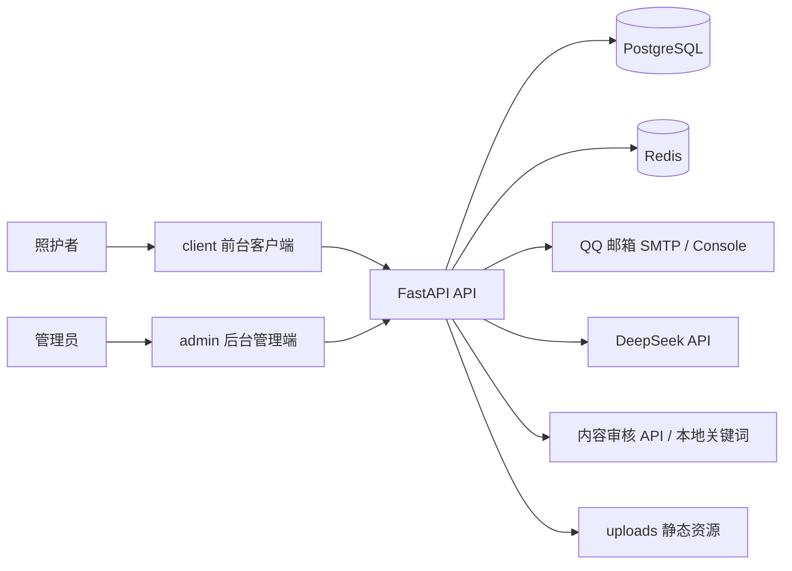
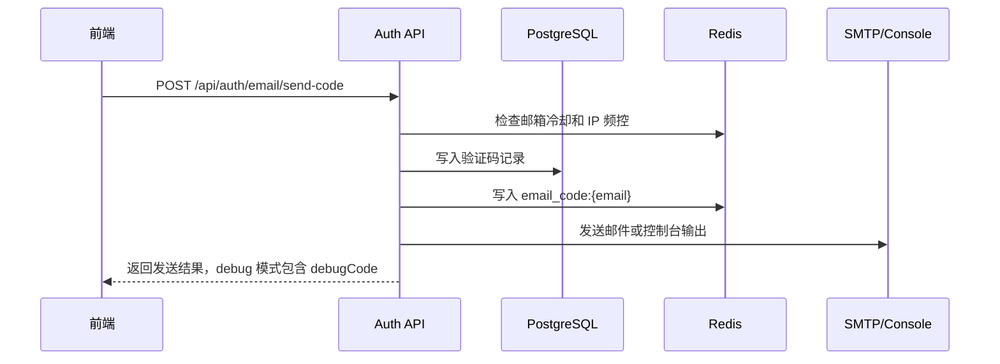
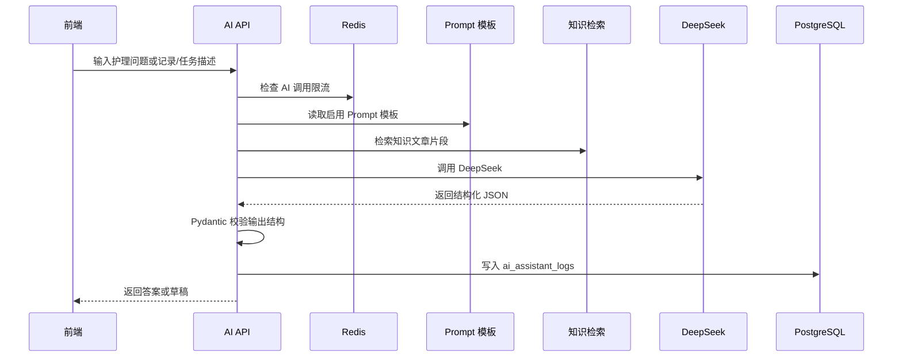
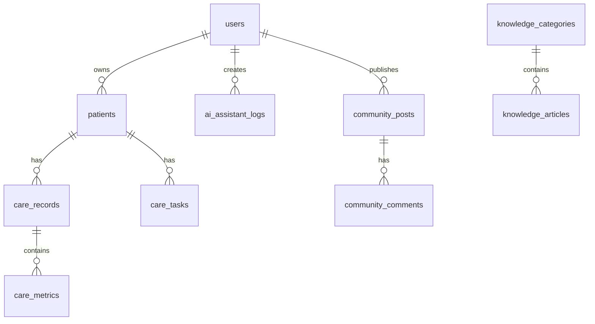

# 医疗照顾者客户端系统项目解析

> 本文档基于当前仓库代码和分轮审计结果整理，用于毕业设计论文中“需求分析、总体设计、详细设计、数据库设计、系统实现、系统测试、总结与展望”等章节参考。文档内容以 `client/`、`admin/`、`server/` 当前实现为依据，并明确区分“已实现能力”“接口层支持但页面未充分展开”“预留/降级功能”和“后续扩展”。

项目名称可表述为：**医疗照顾者的客户端系统设计与实现**。

---

## 1. 项目概述

### 1.1 项目背景

随着老龄化程度加深以及慢性病长期管理需求增长，家庭照护者和护理人员在日常护理过程中需要记录患者基础信息、护理事件、健康指标、任务提醒和异常变化。传统手工记录方式存在数据分散、回顾困难、趋势不清晰、护理任务易遗漏等问题。

本系统面向医疗照顾者日常护理场景，构建一个前后端分离的护理辅助系统。系统通过患者管理、护理记录、护理任务、健康趋势、AI 护理助手、护理知识学习、社区交流和后台管理模块，帮助照护者更高效地完成护理记录、任务安排和健康观察。

### 1.2 系统目标

系统建设目标包括：

1. 建立照护者视角下的患者基础档案管理能力。
2. 使用结构化方式记录血压、血糖、体温、心率、用药、饮食等护理数据。
3. 通过护理任务模块辅助照护者安排每日护理事项并跟踪完成情况。
4. 基于结构化指标生成健康趋势图和趋势分析结果。
5. 通过 AI 护理助手生成护理记录草稿、护理任务草稿和护理问答回复。
6. 通过知识学习模块沉淀护理知识，通过社区模块支持经验交流。
7. 通过后台管理端实现用户、社区审核、知识内容、Prompt 模板和 AI 日志管理。
8. 通过 Redis、SMTP、DeepSeek、内容审核等工程机制提升系统可用性、安全性和可扩展性。

### 1.3 用户角色

| 用户角色 | 主要职责与需求 |
| --- | --- |
| 照护者 / 普通用户 | 注册登录、管理患者、记录护理数据、创建护理任务、查看趋势、使用 AI 助手、学习知识、参与社区 |
| 后台管理员 | 登录后台、查看运营统计、管理用户、审核社区帖子、管理知识内容、维护 Prompt 模板、查看 AI 日志 |

---

## 2. 需求分析

### 2.1 功能性需求

| 模块 | 功能需求 |
| --- | --- |
| 认证模块 | 邮箱验证码注册、邮箱密码登录、找回密码、记住我、当前用户信息、退出登录 |
| 患者管理 | 患者列表、新增患者、患者详情、编辑患者 |
| 护理记录 | 新增护理记录、记录列表、结构化指标存储、记录详情/更新接口支持、AI 草稿确认保存 |
| 护理任务 | 新增任务、任务列表、按状态和患者筛选、完成任务 |
| 健康趋势 | 按患者和指标查看趋势，支持近 7 天、近 30 天、自定义时间范围，支持趋势分析 |
| 照护工作台 | 聚合展示患者、近期记录、待办任务、逾期任务和统计信息 |
| AI 护理助手 | 护理问答、护理记录草稿、护理任务草稿、流式展示、AI 调用日志 |
| 知识学习 | 知识分类、文章/视频知识列表、详情、浏览、点赞、收藏、相关推荐 |
| 社区交流 | 发帖、评论、点赞、收藏、举报、相关讨论、作者其他讨论 |
| 个人中心 | 个人资料、头像、用户统计、通知设置、偏好设置、静态说明页 |
| 后台管理 | 管理员登录、Dashboard、用户管理、社区帖子审核、知识内容管理、Prompt 模板管理、AI 日志 |

### 2.2 非功能性需求

| 类型 | 需求说明 |
| --- | --- |
| 安全性 | 密码哈希存储，JWT 鉴权，普通用户与管理员 token 分离，敏感配置使用环境变量 |
| 可用性 | DeepSeek、Redis、SMTP、内容审核等外部能力异常时，核心业务尽量保持可用或给出友好错误 |
| 可维护性 | 前端按 app/shared/entities/features 分层，后端按 router/schema/service/model 分层 |
| 可扩展性 | 护理指标、知识内容、Prompt 模板、AI provider、内容审核服务均可扩展 |
| 数据一致性 | 护理记录和指标分表，AI 结构化草稿必须人工确认后保存 |
| 性能 | Redis 用于验证码、限流、聚合接口缓存、趋势缓存和 AI 分析缓存 |
| 可测试性 | 提供接口级 smoke test，覆盖认证、患者、记录、任务、趋势、AI、知识、社区和后台主链路 |

---

## 3. 系统总体设计

### 3.1 总体架构

项目采用前后端分离架构，主要由前台客户端、后台管理端、后端服务、数据库、缓存和外部服务组成。



### 3.2 技术选型

| 层级 | 目录 | 技术栈 | 说明 |
| --- | --- | --- | --- |
| 前台客户端 | `client/` | React、TypeScript、Vite、React Router、Tailwind CSS、Recharts、Radix UI、MUI、sonner | 面向照护者的移动端 Web 客户端 |
| 后台管理端 | `admin/` | React、TypeScript，经 `@admin` alias 接入前端构建 | 面向管理员的后台管理页面 |
| 服务端 | `server/` | FastAPI、Pydantic、SQLAlchemy 2.x、Alembic、python-jose、passlib、httpx、redis | 业务 API、鉴权、数据访问、AI、缓存、邮件 |
| 数据库 | PostgreSQL 16 | 关系型数据库 | 存储用户、患者、护理记录、任务、知识、社区、AI 日志等数据 |
| 缓存 | Redis 7 | 键值缓存 | 验证码、限流、聚合接口缓存、趋势缓存 |
| AI 服务 | DeepSeek + fallback | 服务端调用 | AI 问答、草稿生成、趋势分析 |
| 邮件服务 | QQ SMTP / console | 服务端发送 | 邮箱验证码发送，本地开发可使用 console/debugCode |

### 3.3 仓库结构

| 路径 | 作用 |
| --- | --- |
| `client/` | 前台客户端源码与 Vite 配置 |
| `admin/` | 后台管理端源码，通过 `client/vite.config.ts` 中的 `@admin` alias 接入 |
| `server/` | FastAPI 后端、ORM 模型、Schema、业务服务、迁移脚本、seed、测试脚本 |
| `docker-compose.yml` | PostgreSQL 和 Redis 本地容器编排 |
| `README.md`、`server/README.md` | 启动、环境变量、Docker、SMTP、Redis、AI 和测试说明 |
| `api.yaml` | 早期接口草稿，当前已落后于真实后端接口，最终接口应以 FastAPI OpenAPI 为准 |

### 3.4 前端结构

`client/src` 采用接近 Feature-Sliced 的组织方式：

| 目录 | 说明 |
| --- | --- |
| `app/` | 路由、页面入口、布局、全局组件 |
| `shared/` | API client、认证存储、日期工具、通用 UI、主题等 |
| `entities/` | 患者、护理记录、护理任务、AI、趋势等领域类型和 mapper |
| `features/` | auth、home、patients、records、tasks、trends、ai、knowledge、community、profile、care 等业务模块 |

需要注意：当前仍有部分页面位于 `client/src/app/pages`，如登录、注册、患者列表、记录列表、趋势页和 AI 页面。因此论文中应表述为“以前端 feature 模块组织为主”，不要写成“所有页面均完全 feature 化”。

### 3.5 后端结构

`server/app` 采用分层结构：

| 目录 | 说明 |
| --- | --- |
| `api/routes/` | FastAPI Router，负责 HTTP API、依赖注入和统一响应 |
| `schemas/` | Pydantic DTO，负责请求/响应字段和 camelCase 转换 |
| `services/` | 业务逻辑层，封装认证、患者、记录、任务、AI、缓存、邮件、审核等逻辑 |
| `models/` | SQLAlchemy ORM 模型，与数据库表对应 |
| `core/` | 配置、数据库连接、Redis、鉴权、安全、统一响应 |

后端成功响应统一为：

```json
{ "success": true, "data": {} }
```

错误响应统一为：

```json
{ "success": false, "message": "错误提示" }
```

---

## 4. 前台功能模块设计

### 4.1 认证与账号模块

前端路径：`client/src/features/auth`、`client/src/app/pages/LoginPage.tsx`、`RegisterPage.tsx`、`ForgotPasswordPage.tsx`。  
后端路径：`server/app/api/routes/auth.py`、`server/app/services/auth_service.py`。

主要功能：

1. 邮箱验证码注册。
2. 邮箱密码登录。
3. 找回密码。
4. 记住我：选择 localStorage 或 sessionStorage 保存 token。
5. 获取当前用户信息。
6. 退出登录。

验证码流程：



后端注册 Schema 接收 `username`、`email`、`code`、`password`。`confirmPassword` 只属于前端表单校验字段，不进入后端 Schema。

### 4.2 首页模块

前端路径：`client/src/features/home`。  
后端路径：`server/app/api/routes/home.py`、`home_service.py`。

首页用于展示照护者当天工作概览，包括统计卡片、健康提醒、任务提醒和最近患者。健康提醒由后端根据最新结构化指标生成，例如血压、血糖、体温、心率超过阈值时形成提醒。

### 4.3 患者管理模块

前端路径：`client/src/features/patients`、部分页面位于 `client/src/app/pages`。  
后端路径：`server/app/api/routes/patients.py`、`patient_service.py`。

功能包括患者列表、新增患者、患者详情和编辑患者。患者正式字段保持 MVP 边界：

| 字段 | 说明 |
| --- | --- |
| `name` | 患者姓名 |
| `age` | 年龄 |
| `gender` | 性别：男、女、其他 |
| `profileNote` | 护理说明 |

患者详情页中的护理统计、近期记录、近期任务、趋势预览等属于派生展示数据，不扩展患者表字段。

### 4.4 护理记录模块

前端路径：`client/src/features/records`、`client/src/app/pages/RecordListPage.tsx`。  
后端路径：`server/app/api/routes/records.py`、`record_service.py`。

护理记录采用“事件 + 指标”双层模型：

| 层级 | 表 | 作用 |
| --- | --- | --- |
| 护理事件 | `care_records` | 保存一次护理记录的患者、类型、时间、备注、来源 |
| 护理指标 | `care_metrics` | 保存该记录下的结构化指标，如收缩压、舒张压、体温、血糖 |

支持的记录类型：

| 类型 | 说明 |
| --- | --- |
| `blood_pressure` | 血压 |
| `temperature` | 体温 |
| `blood_sugar` | 血糖 |
| `heart_rate` | 心率 |
| `medication` | 用药 |
| `diet` | 饮食 |
| `other` | 其他观察 |

血压必须拆分为：

- `bloodPressureSystolic`
- `bloodPressureDiastolic`

而不是保存为 `120/80` 字符串。这样可以支持趋势图、异常判断和统计分析。

当前后端支持护理记录列表、创建、详情和更新接口；前端路由主要覆盖列表和新增，独立记录详情页未充分展开。论文中应写“接口层支持详情与更新”，不要夸大为完整记录详情页面。

### 4.5 护理任务模块

前端路径：`client/src/features/tasks`。  
后端路径：`server/app/api/routes/tasks.py`、`task_service.py`。

任务字段包括：

| 字段 | 说明 |
| --- | --- |
| `patientId` | 所属患者 |
| `title` | 任务标题 |
| `description` | 任务描述 |
| `taskType` | 任务类型 |
| `remindTime` | 提醒时间 |
| `repeatRule` | 重复规则 |
| `priority` | 优先级 |
| `remindOffsetMinutes` | 提前提醒分钟数 |
| `status` | 任务状态 |

任务状态以当前代码为准：

```text
pending / completed / scheduled
```

任务模块已支持列表、创建、更新、详情接口和完成任务接口。但当前实现重点是任务记录与状态管理，不包含后台定时推送、消息队列或系统级通知推送。

### 4.6 照护工作台模块

前端路径：`client/src/features/care`。  
后端路径：`server/app/api/routes/care.py`、`care_service.py`。

照护工作台提供患者、最近护理记录和待办任务的聚合视图。后端提供独立接口：

```text
GET /api/care/workbench
```

该接口按用户使用 Redis 短缓存，key 为：

```text
cache:care:workbench:{userId}
```

TTL 为 30 秒。患者、护理记录、任务写入后会清理工作台缓存。

### 4.7 健康趋势模块

前端路径：`client/src/features/trends`、`client/src/app/pages/HealthTrendPage.tsx`。  
后端路径：`server/app/api/routes/trends.py`、`trend_service.py`。

趋势模块基于 `care_metrics` 时间序列数据，支持：

1. 按患者查询指定指标。
2. 支持 `startAt`、`endAt` 时间范围。
3. 支持近 7 天、近 30 天、自定义范围。
4. 支持血压双线、血糖、体温、心率等指标。
5. 支持趋势分析输出。

趋势分析输出包括：

| 字段 | 说明 |
| --- | --- |
| `summary` | 趋势摘要 |
| `riskLevel` | 风险等级 |
| `highlights` | 关键观察点 |
| `suggestions` | 护理建议 |
| `riskNote` | 风险提示 |
| `generatedBy` | 生成来源，如 DeepSeek 或 fallback |

趋势分析采用 DeepSeek 结构化分析与规则 fallback 双路径。该能力只用于护理辅助观察，不构成医学诊断。

### 4.8 AI 护理助手模块

前端路径：`client/src/features/ai`、`client/src/app/pages/AIAssistantPage.tsx`、`AIConfirmPage.tsx`。  
后端路径：`server/app/api/routes/ai.py`、`ai_service.py`、`deepseek_service.py`、`prompt_service.py`、`rag_service.py`。

支持意图：

| intent | 说明 |
| --- | --- |
| `qa` | 护理问答 |
| `care_record` | 护理记录草稿 |
| `care_task` | 护理任务草稿 |
| `form_prefill` | 预留意图，当前不作为独立持久化对象 |

AI 工作流：



AI 模块的重要边界：

1. DeepSeek key 只在服务端读取，前端不接触真实 API key。
2. DeepSeek 失败、未配置或返回结构不合规时自动 fallback。
3. AI 输出必须经过 Pydantic Schema 校验。
4. AI 草稿不直接写入业务表，而是进入确认页，由用户确认后再调用护理记录或任务接口保存。
5. AI stream 接口是后端将最终回答切分为 SSE 输出，不是 DeepSeek 原生 token 流式透传。
6. RAG 是基于知识文章的关键词检索增强，不是向量数据库或 embedding 检索。

### 4.9 知识学习模块

前端路径：`client/src/features/knowledge`。  
后端路径：`server/app/api/routes/knowledge.py`、`knowledge_service.py`。

功能包括：

1. 知识分类。
2. 文章/视频内容列表。
3. 搜索与分类筛选。
4. 详情页。
5. 浏览量记录。
6. 点赞和取消点赞。
7. 收藏和取消收藏。
8. 相关推荐。

知识文章状态：

```text
published / draft / archived
```

前台只展示 `published` 内容，后台可以管理草稿、发布和下架状态。视频知识支持配置 `videoUrl` 并由前端使用原生 video 标签播放；不要将其表述为完整视频课程平台。

### 4.10 社区交流模块

前端路径：`client/src/features/community`。  
后端路径：`server/app/api/routes/community.py`、`community_service.py`、`content_moderation_service.py`。

功能包括：

1. 发帖。
2. 帖子列表和详情。
3. 评论。
4. 点赞。
5. 收藏和取消收藏。
6. 举报。
7. 相关推荐和作者其他帖子。

社区状态统一为：

```text
pending / passed / rejected
```

帖子创建后默认进入 `pending`，需要后台审核。评论会经过内容审核服务，审核通过后进入 `passed`。内容审核包含本地敏感词拦截，并在配置 API key 时调用外部内容审核服务。

当前未确认实现的高级社交功能包括：关注作者、评论回复、评论点赞、取消点赞。这些应写为后续扩展，而不是已实现功能。

### 4.11 个人中心模块

前端路径：`client/src/features/profile`。  
后端路径：`server/app/api/routes/users.py`、`user_service.py`。

功能包括：

1. 当前用户资料。
2. 资料编辑。
3. 头像更新。
4. 用户统计。
5. 通知设置。
6. 偏好设置。
7. 关于、指南、隐私、条款等静态说明页。

头像更新基于 `imageData`，后端处理后提供 `/uploads` 静态访问。论文表述可以写“头像更新”，不要写成 multipart 文件上传，除非后续代码明确改为 multipart。

---

## 5. 后台管理模块设计

后台管理端位于 `admin/src/admin`，通过 `@admin` alias 接入前端构建。后台路由位于 `/admin/*`。

### 5.1 管理员登录与鉴权

后台管理员使用独立表 `admin_users`。前端使用独立 token key：

```text
care-app-admin-token
```

`AdminLayout` 会检查 admin token，并调用 `/api/admin/me` 验证管理员身份。验证失败时清理 token 并跳转登录页。

### 5.2 Dashboard

后台 Dashboard 显示用户、患者、记录、任务、知识文章、待审核内容和 AI 日志等统计数据。该接口使用 Redis 缓存：

```text
cache:admin:dashboard_summary
```

TTL 为 60 秒。

### 5.3 用户管理

后台支持用户列表、关键词搜索和启用/禁用用户。用户状态为：

```text
active / disabled
```

当前前端用户状态筛选主要在本地完成，不应表述为复杂后端多条件用户管理系统。

### 5.4 社区审核

后台当前主要确认的是社区帖子审核，包括查看待审核、已通过、已拒绝帖子，并支持通过或拒绝。评论数据本身有状态字段，但后台评论审核页面/接口需要以最终路由为准，不应在论文中过度夸大。

### 5.5 知识内容管理

后台支持知识文章列表、创建、编辑、发布、下架。文章类型包括：

```text
article / video
```

状态包括：

```text
published / draft / archived
```

当前是基础内容管理能力，不包含复杂富文本编辑器、图片资源管理或批量内容发布。

### 5.6 Prompt 模板管理

Prompt 模板存储于 `prompt_templates` 表。后台可读取和保存 Prompt 模板。后端 AI 服务和趋势分析服务会读取启用模板，因此 Prompt 管理不是单纯页面预留。

默认 Prompt key 包括：

| key | 用途 |
| --- | --- |
| `ai_assistant_system` | AI 助手系统约束 |
| `ai_assistant_qa` | 护理问答 |
| `ai_assistant_record_draft` | 护理记录草稿 |
| `ai_assistant_task_draft` | 护理任务草稿 |
| `ai_rag_policy` | RAG 回答约束 |
| `ai_trend_analysis` | 趋势分析 |

### 5.7 AI 日志

AI 调用写入 `ai_assistant_logs` 表。后台可查看用户输入、识别意图、AI 回复、草稿 payload、引用来源和风险提示。该模块可作为 AI 可审计性的实现依据。

---

## 6. 数据库设计

### 6.1 数据库总体结构

当前 ORM 层包含以下主要表：

| 类型 | 表 |
| --- | --- |
| 用户认证 | `users`、`email_verification_codes`、`admin_users` |
| 用户设置 | `user_notification_settings`、`user_preferences` |
| 患者护理 | `patients`、`care_records`、`care_metrics`、`care_tasks` |
| 知识学习 | `knowledge_categories`、`knowledge_articles`、`user_knowledge_likes`、`user_knowledge_bookmarks` |
| 社区交流 | `community_posts`、`community_comments`、`community_post_likes`、`community_post_bookmarks`、`community_post_reports` |
| AI 运维 | `ai_assistant_logs`、`prompt_templates` |

### 6.2 核心 ER 关系



### 6.3 患者表

`patients` 表只保存患者基础档案：

| 字段 | 说明 |
| --- | --- |
| `id` | 主键 |
| `user_id` | 所属用户 |
| `name` | 姓名 |
| `age` | 年龄 |
| `gender` | 性别 |
| `profile_note` | 护理说明 |
| `created_at`、`updated_at` | 创建和更新时间 |

不将电话、地址、病史、紧急联系人等复杂字段直接扩展进患者表，这是为了保持 MVP 数据模型稳定。

### 6.4 护理记录与指标表

`care_records` 保存护理事件，`care_metrics` 保存该事件下的指标。

`care_metrics` 同时支持：

| 字段 | 说明 |
| --- | --- |
| `value_numeric` | 数值型指标，如血压、血糖、体温、心率 |
| `value_text` | 文本型指标，如用药名称、饮食描述、观察文本 |
| `unit` | 单位 |

该设计使不同记录类型可以复用同一套结构，同时支持趋势统计。

### 6.5 护理任务表

`care_tasks` 保存与患者绑定的任务。核心枚举包括：

| 字段 | 可选值 |
| --- | --- |
| `task_type` | `blood_pressure`、`blood_sugar`、`medication`、`diet`、`rehab`、`appointment`、`nutrition`、`other` |
| `repeat_rule` | `once`、`daily`、`weekly`、`monthly` |
| `priority` | `low`、`normal`、`high` |
| `status` | `pending`、`completed`、`scheduled` |

### 6.6 知识与社区表

知识模块包括分类、文章、点赞和收藏。社区模块包括帖子、评论、点赞、收藏和举报。社区内容审核状态统一为：

```text
pending / passed / rejected
```

### 6.7 AI 日志与 Prompt 表

`ai_assistant_logs` 使用 JSONB 保存：

- `draft_payload`
- `sources`

这使 AI 草稿和引用来源可以灵活存储，并供后台审计。

`prompt_templates` 用于后台维护 Prompt 模板，状态为：

```text
active / disabled
```

### 6.8 Schema 设计

后端 Pydantic Schema 使用 `CamelModel` 将 snake_case 自动转换为 camelCase。分页返回格式统一为：

```json
{
  "items": [],
  "page": 1,
  "pageSize": 20,
  "total": 0
}
```

### 6.9 迁移注意事项

当前 ORM 模型已经覆盖 Admin、Community、Prompt、头像、视频等完整数据结构。但代码审计中成功读取到的 Alembic 迁移主要包括初始表和知识模块迁移。正式交付前应再次验证全新数据库执行：

```powershell
alembic upgrade head
python scripts/seed.py
python scripts/api_smoke_test.py
```

若全新数据库不能创建 Admin、Community、Prompt 等表，需要补充迁移文件。论文可基于 ORM 说明数据库设计，但部署说明应以最终迁移链验证结果为准。

---

## 7. AI 辅助与安全确认机制

### 7.1 AI 输出结构

AI 响应包含：

| 字段 | 说明 |
| --- | --- |
| `conversationId` | 对话 ID |
| `intent` | 意图 |
| `answerText` | 文本回答 |
| `draftType` | 草稿类型：record、task 或 null |
| `draftPayload` | 结构化草稿 |
| `sources` | 知识来源 |
| `riskNote` | 风险提示 |
| `generatedBy` | 生成来源 |

### 7.2 结构化草稿校验

DeepSeek 返回结果必须经过后端 Pydantic 模型校验：

1. `care_record` 必须对应 `draftType=record`。
2. `care_task` 必须对应 `draftType=task`。
3. `qa` 不允许返回草稿。
4. 血压必须拆分为收缩压和舒张压。
5. 任务类型、重复规则、优先级受枚举约束。

### 7.3 人工确认保存

AI 草稿不会直接入库。前端将草稿暂存到 sessionStorage，并引导用户进入 `/ai-confirm`。用户确认后才调用护理记录或任务接口保存。

这一机制可作为论文亮点：**AI 只辅助生成结构化草稿，最终保存权由用户确认，兼顾效率与安全性。**

### 7.4 RAG 检索边界

当前 RAG 是基于知识文章的关键词检索增强：抽取关键词、匹配 published 知识文章、截取片段、返回 sources。它不是向量数据库 RAG，不涉及 embedding 或向量召回。论文中应写“轻量级知识检索增强”。

---

## 8. Redis、SMTP 与缓存限流设计

### 8.1 Redis 使用原则

Redis 设计原则是：**可用时增强，不可用时不打断主业务**。Redis 异常时，验证码仍有数据库兜底，业务查询仍可访问 PostgreSQL，只是限流和缓存能力退化。

### 8.2 认证安全相关 Redis key

| 场景 | key | 说明 |
| --- | --- | --- |
| 验证码缓存 | `email_code:{email}` | 保存验证码 |
| 发送冷却 | `email_code_cooldown:{email}` | 同邮箱 60 秒冷却 |
| 验证码错误计数 | `email_code_fail:{email}` | 错误次数计数 |
| 验证码锁定 | `email_code_lock:{email}` | 错误过多锁定 10 分钟 |
| 发送 IP 限流 | `rate:send_code:ip:{ip}` | 同 IP 每分钟最多 10 次 |
| 登录错误计数 | `login_fail:{email}` | 登录失败计数 |
| 登录锁定 | `login_lock:{email}` | 登录失败过多锁定 10 分钟 |
| 登录 IP 限流 | `rate:login:ip:{ip}` | 同 IP 每分钟最多 20 次 |

### 8.3 AI 限流

AI 接口通过 Redis 进行用户级限流：

| 规则 | 说明 |
| --- | --- |
| 每分钟最多 10 次 | 防止短时间频繁调用模型 |
| 每天最多 200 次 | 控制模型调用成本 |

超限时返回 429，不调用 DeepSeek，也不写入 AI 日志。

### 8.4 聚合缓存

| 接口 | Redis key | TTL |
| --- | --- | --- |
| 后台 Dashboard | `cache:admin:dashboard_summary` | 60 秒 |
| 照护工作台 | `cache:care:workbench:{userId}` | 30 秒 |
| 知识分类 | `cache:knowledge:categories` | 600 秒 |
| 趋势数据 | `cache:trend:data:*` | 约 10 分钟 |
| 趋势分析 | `cache:trend:analysis:*` | 约 24 小时 |

### 8.5 QQ SMTP

邮件服务支持两种模式：

| 模式 | 使用场景 |
| --- | --- |
| `console` | 本地开发和 smoke test，允许返回 debugCode |
| `smtp` | 真实发送 QQ 邮箱验证码 |

`SMTP_PASSWORD` 是 QQ 邮箱授权码，不是 QQ 登录密码。真实密钥只能放在 `server/.env`，不能提交到代码仓库。

---

## 9. 接口设计概览

当前真实接口应以 FastAPI 路由和 `/openapi.json` 为准。仓库中的 `api.yaml` 是早期第一批非 AI API 草稿，已明显落后于当前代码。

主要接口包括：

| 模块 | 代表接口 |
| --- | --- |
| Auth | `/api/auth/email/send-code`、`/api/auth/register`、`/api/auth/login`、`/api/auth/password/reset` |
| Users | `/api/users/me`、资料、头像、统计、通知设置、偏好设置 |
| Home | `/api/home/summary` |
| Patients | `/api/patients`、`/api/patients/{id}`、`/api/patients/{id}/dashboard` |
| Records | `/api/care-records`、`/api/care-records/{id}` |
| Tasks | `/api/tasks`、`/api/tasks/{id}`、`/api/tasks/{id}/complete` |
| Trends | `/api/patients/{id}/metrics/trend`、`/api/patients/{id}/metrics/trend-analysis` |
| AI | `/api/ai/assistant`、`/api/ai/assistant/stream` |
| Knowledge | 分类、文章列表、详情、浏览、点赞、收藏、相关推荐 |
| Community | 帖子、评论、点赞、收藏、举报、相关讨论、作者帖子 |
| Admin | 登录、Dashboard、用户、审核、知识、Prompt、AI 日志 |
| Care | `/api/care/workbench` |

---

## 10. 系统测试与运行环境

### 10.1 运行环境

本地开发环境通过 Docker Compose 管理 PostgreSQL 和 Redis：

| 服务 | 镜像 | 端口 |
| --- | --- | --- |
| PostgreSQL | `postgres:16` | `5432:5432` |
| Redis | `redis:7-alpine` | `6379:6379` |

后端依赖包括 FastAPI、SQLAlchemy、Alembic、psycopg、python-jose、passlib、httpx、redis 等。前端使用 Vite + React + TypeScript。

### 10.2 Seed 数据

`server/scripts/seed.py` 提供演示数据：

| 类型 | 数据 |
| --- | --- |
| 普通用户 | `caregiver@example.com / password123` |
| 管理员 | `admin@example.com / admin123` |
| 患者 | 张明、李芳 |
| 护理数据 | 多条血压记录，包含收缩压和舒张压指标 |
| 护理任务 | 每日测量血压任务 |
| 知识分类 | 慢病管理、饮食护理、康复训练、常见症状处理 |
| 知识文章 | 高血压、糖尿病、营养、压疮预防、康复训练、发热观察等 |
| 社区数据 | 已通过帖子、待审核帖子、评论 |

### 10.3 API Smoke Test

`server/scripts/api_smoke_test.py` 使用 httpx 对真实后端进行接口级冒烟测试。覆盖范围包括：

1. `/health` 与 Redis 状态。
2. 邮箱验证码发送、注册、Redis 缓存和冷却。
3. 普通用户登录和当前用户。
4. 患者创建与查询。
5. 护理记录创建与趋势查询。
6. 护理任务创建、查询和完成。
7. Knowledge 分类、列表、详情、浏览、点赞、收藏。
8. Community 发帖、列表、详情、评论、点赞、收藏、举报。
9. Care Workbench 聚合接口。
10. AI QA、record draft、task draft。
11. Admin 登录、Dashboard、用户列表、帖子审核、知识文章、AI 日志。

该测试是接口级集成/冒烟测试，不等同于完整浏览器 E2E。它不覆盖页面样式、所有前端点击路径、真实 QQ SMTP 发信质量、DeepSeek 模型输出质量或压力测试。

---

## 11. 当前实现边界与谨慎表述

为了论文表述准确，以下内容需要谨慎：

1. `api.yaml` 是早期草稿，不是当前完整 API 契约。
2. AI stream 是 SSE 流式展示，不是 DeepSeek 原生 token stream。
3. RAG 是关键词检索增强，不是向量数据库 RAG。
4. AI 趋势分析是护理参考，不构成医学诊断。
5. AI 草稿使用 sessionStorage 临时保存，不是完整长期会话管理系统。
6. logout 当前不是服务端 token blacklist 机制。
7. 社区没有确认实现关注作者、评论回复、评论点赞、取消点赞等高级社交功能。
8. 后台审核以社区帖子审核为主，评论审核是否完整应以最终 route 和页面为准。
9. 知识视频支持 `videoUrl` 播放，但不是完整视频课程平台。
10. 护理任务包含提醒字段，但未确认后台定时推送或消息队列。
11. Alembic 迁移链需要在全新数据库上再次验证是否覆盖全部 ORM 模型。
12. 前台以 feature 模块组织为主，但仍有部分页面位于 `client/src/app/pages`。

---

## 12. 论文写作章节映射

| 论文章节 | 可引用内容 |
| --- | --- |
| 绪论 | 老龄化、慢病护理、照护者数据记录痛点、系统建设意义 |
| 需求分析 | 用户角色、功能需求、非功能需求 |
| 总体设计 | React + FastAPI + PostgreSQL + Redis 架构，前后台分离，模块划分 |
| 数据库设计 | 用户、患者、护理记录、指标、任务、知识、社区、AI 日志、Prompt 表 |
| 详细设计 | 认证、患者、记录、任务、趋势、AI、知识、社区、后台管理 |
| 系统实现 | API client、JWT、Redis、SMTP、DeepSeek、fallback、RAG、Prompt、内容审核 |
| 系统测试 | smoke test、接口测试、Seed 数据、Redis 验证、AI 草稿测试 |
| 总结与展望 | 已完成能力、当前边界、移动端原生化、消息推送、向量 RAG、完整 E2E 测试等后续方向 |

---

## 13. 项目亮点总结

1. **护理记录双层建模**：使用 `care_records` 保存护理事件，使用 `care_metrics` 保存结构化指标。
2. **血压双指标存储**：收缩压与舒张压分开保存，支持趋势分析。
3. **AI 草稿确认机制**：AI 只生成草稿，必须由用户确认后保存。
4. **DeepSeek + fallback**：真实模型不可用时仍能保持核心 AI 功能可用。
5. **Prompt 模板管理**：后台 Prompt 模板真实参与 AI 助手和趋势分析。
6. **轻量级知识检索增强**：AI 回答可引用已发布知识文章片段。
7. **Redis 工程增强**：验证码、限流、聚合缓存、趋势缓存均使用 Redis。
8. **QQ SMTP / console 双模式**：兼顾本地测试和真实验证码发送。
9. **后台 AI 日志审计**：AI 调用、意图、草稿、风险提示可被后台查看。
10. **接口级 smoke test**：覆盖主业务链路，支持交付前快速验证。

## 14. 后续优化方向

1. 补齐并验证 Alembic 迁移链，确保全新数据库可完整创建所有表。
2. 从 FastAPI `/openapi.json` 重新导出当前完整 OpenAPI 文档，替换过时 `api.yaml`。
3. 为前端补充 Playwright E2E 测试，覆盖真实页面点击流程。
4. 为护理记录补充独立详情/编辑页面。
5. 引入定时任务或消息推送，实现真正提醒通知。
6. 将 RAG 从关键词检索升级为 embedding + 向量数据库召回。
7. 增加社区评论回复、评论点赞、作者关注等高级社交功能。
8. 优化前端路由懒加载，降低构建包体积。
9. 完善部署流程，增加 Dockerfile、生产环境配置和 CI 测试。
10. 在保证安全边界的前提下，继续优化 AI 护理建议质量。
