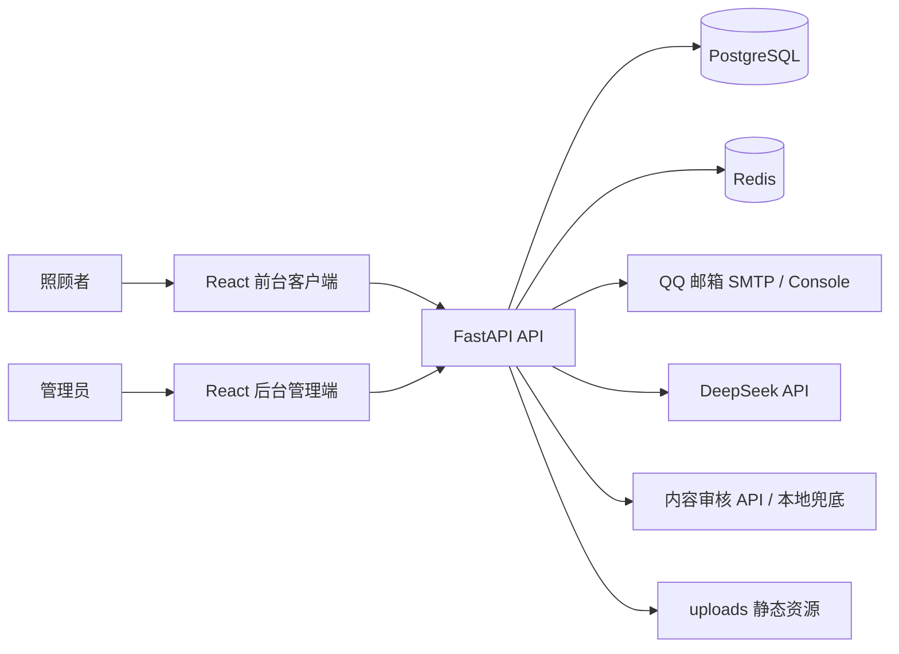
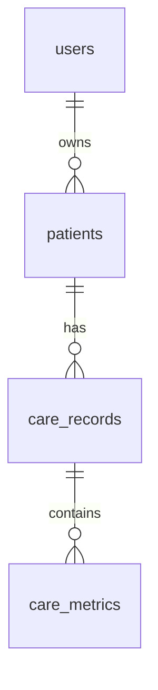
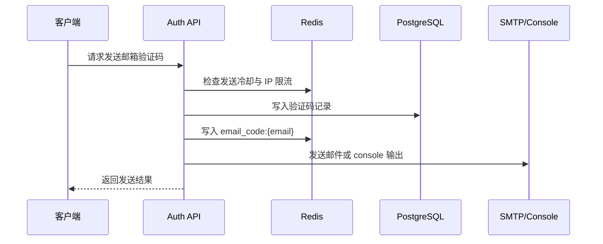
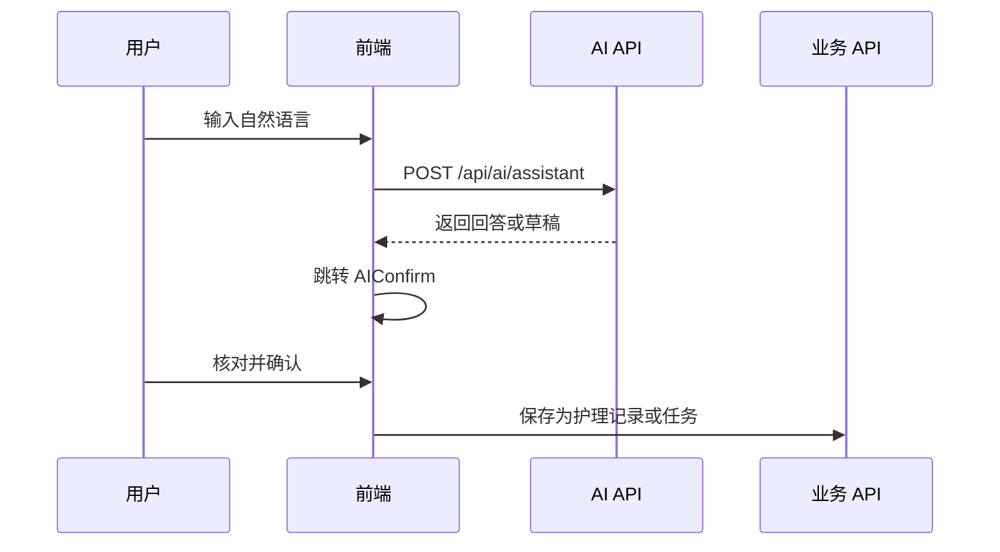

# 医疗照顾者客户端系统项目解析（修订版）

> 本文档基于当前仓库代码重新整理，用于毕业设计论文中“需求分析、总体设计、详细设计、系统实现、系统测试、总结与展望”等章节参考。相比原 `PROJECT_ANALYSIS.md`，本修订版重点修正目录结构、模块边界和已实现/预留功能的表述，避免把预留功能写成完整实现。

## 1. 项目定位与建设目标

项目名称可表述为：**医疗照顾者的客户端系统设计与实现**。

系统面向医疗照顾者的日常护理场景，围绕患者档案、护理记录、护理任务、健康趋势、AI 辅助、护理知识学习、社区交流和后台管理构建前后端分离的护理辅助系统。

| 用户角色 | 主要需求 |
| --- | --- |
| 医疗照顾者 / 家庭照护者 | 管理患者信息，记录护理数据，安排护理任务，查看健康趋势，获得 AI 辅助建议 |
| 后台管理员 | 管理用户、知识内容、社区审核、Prompt 模板、AI 日志和系统统计 |

系统目标包括：

1. 建立照顾者视角下的患者管理与护理数据记录体系。
2. 将血压、血糖、体温、心率、用药、饮食等护理数据结构化保存。
3. 通过任务模块辅助照顾者安排护理事项并跟踪完成情况。
4. 通过趋势图和趋势分析帮助照顾者理解患者近期健康变化。
5. 通过 AI 护理助手生成护理记录草稿、护理任务草稿并回答一般护理问题。
6. 通过知识学习和社区交流沉淀护理经验。
7. 通过后台管理实现内容运营、社区审核、用户管理、AI 日志和 Prompt 运维。

## 2. 系统总体架构

项目采用前后端分离架构。前端包括面向照顾者的移动端 Web 客户端和面向管理员的后台管理端；后端采用 FastAPI 提供 REST API；数据库使用 PostgreSQL；缓存、验证码、限流和部分聚合数据缓存使用 Redis；AI 能力由 DeepSeek 接口与规则 fallback 共同支持。



| 层级 | 实际目录 | 技术栈 | 说明 |
| --- | --- | --- | --- |
| 前台客户端 | `client/` | React、TypeScript、Vite、Tailwind CSS、React Router、Recharts、lucide-react | 面向照顾者的移动端 Web 页面 |
| 后台管理端 | `admin/` | React、TypeScript、Vite 共享构建 | 面向管理员的运营管理页面 |
| 服务端 | `server/` | FastAPI、SQLAlchemy、Alembic、Pydantic、PostgreSQL、Redis | 业务 API、数据访问、认证、AI、缓存、邮件 |
| 数据库 | PostgreSQL | 关系型数据库 | 存储用户、患者、护理记录、任务、知识、社区、AI 日志等 |
| 缓存 | Redis | 键值缓存 | 验证码缓存、限流、工作台/后台/知识分类/趋势缓存 |
| AI | DeepSeek API + fallback | 服务端调用 | AI 问答、护理记录草稿、护理任务草稿、趋势分析 |
| 邮件 | QQ 邮箱 SMTP / Console | 服务端发送 | 邮箱验证码发送，本地开发可使用 console 模式 |

## 3. 仓库结构说明

| 路径 | 说明 |
| --- | --- |
| `client/` | 前台客户端源码和 Vite 配置 |
| `admin/` | 后台管理端源码，通过前端构建 alias 接入 |
| `server/` | FastAPI 后端、Alembic、脚本、环境变量示例 |
| `docker-compose.yml` | PostgreSQL 与 Redis 本地容器编排 |
| `api.yaml` | API 描述文件 |
| `PROJECT_ANALYSIS.md` | 原项目分析文档 |
| `PROJECT_ANALYSIS_REVISED.md` | 当前修订版分析文档 |

### 3.1 前台客户端结构

`client/src` 采用接近 Feature-Sliced 的组织方式：

| 目录 | 说明 |
| --- | --- |
| `app/` | 路由、页面入口、应用壳层、全局 Provider |
| `shared/` | 通用 API 客户端、认证工具、日期工具、主题、复用 UI |
| `entities/` | 患者、护理记录、护理任务、AI、趋势等领域模型和 mapper |
| `features/` | auth、home、patients、records、tasks、trends、ai、knowledge、community、profile、care 等业务模块 |

前端请求统一通过 `shared/lib/apiClient.ts` 封装，负责 baseURL、token 注入、统一响应解析和错误处理。前端 DTO 通常采用 camelCase，后端数据库字段采用 snake_case，由 schema 和 mapper 进行转换。

### 3.2 后台管理端结构

后台管理端位于 `admin/src/admin`：

| 目录 | 说明 |
| --- | --- |
| `pages/` | 后台页面：登录、Dashboard、用户、审核、内容、Prompt、AI 日志 |
| `services/admin.service.ts` | 后台 API 封装，使用独立管理员 token |
| `state/` | 后台页面状态 Hook |
| `model.ts` | 后台 DTO、枚举和表单草稿类型 |

后台 token 使用独立存储键 `care-app-admin-token`，避免和普通用户 token 混用。

### 3.3 服务端结构

`server/app` 采用 Router、Schema、Service、Model 分层：

| 目录 | 说明 |
| --- | --- |
| `api/routes/` | FastAPI 路由层，定义 HTTP API、依赖注入和统一响应 |
| `schemas/` | Pydantic schema，定义请求和响应结构 |
| `services/` | 业务逻辑层，处理查询、写入、缓存、AI、邮件、审核等逻辑 |
| `models/` | SQLAlchemy ORM 模型，与数据库表对应 |
| `core/` | 配置、数据库连接、Redis、响应封装、安全工具 |

`server/app/main.py` 注册 `auth`、`admin`、`users`、`home`、`care`、`community`、`knowledge`、`patients`、`records`、`tasks`、`trends`、`ai` 等路由，并挂载 `/uploads` 静态资源目录。

## 4. 业务需求分析

### 4.1 功能性需求

| 模块 | 功能需求 |
| --- | --- |
| 认证模块 | 邮箱验证码注册、邮箱密码登录、记住我、当前用户信息、退出登录 |
| 患者管理 | 患者列表、新增患者、患者详情、编辑患者 |
| 护理记录 | 新增记录、记录列表、结构化指标存储、AI 草稿确认入库 |
| 护理任务 | 新增任务、任务列表、筛选任务、完成任务 |
| 健康趋势 | 按患者和指标查看趋势，支持近 7 天、近 30 天、自定义时间范围，支持趋势分析接口 |
| 照护工作台 | 聚合展示患者、近期记录、即将到来的任务和统计信息 |
| AI 助手 | 护理问答、护理记录草稿、护理任务草稿、流式输出、AI 日志 |
| 知识学习 | 知识分类、文章列表、文章详情、浏览、点赞、收藏、相关推荐 |
| 社区交流 | 发帖、列表、详情、评论、点赞、收藏、举报、相关帖子 |
| 个人中心 | 个人信息、头像、统计、通知设置、偏好设置、静态说明页 |
| 后台管理 | 管理员登录、Dashboard、用户管理、社区审核、知识管理、Prompt 管理、AI 日志 |

### 4.2 非功能性需求

| 类型 | 设计目标 |
| --- | --- |
| 安全性 | 密码哈希存储，JWT 认证，前后台 token 分离，敏感配置通过 `.env` 读取 |
| 可用性 | Redis 或外部模型不可用时，核心业务仍能走数据库或 fallback |
| 可维护性 | 前端按 feature 拆分，后端按 Router/Schema/Service/Model 分层 |
| 可扩展性 | 护理指标、知识内容、Prompt 模板和 AI provider 可继续扩展 |
| 性能 | Redis 用于验证码、限流、聚合接口和趋势缓存 |
| 数据一致性 | 护理记录事件与指标分表，AI 草稿必须人工确认后保存 |

## 5. 核心数据模型设计

### 5.1 用户与认证

| 表 | 作用 |
| --- | --- |
| `users` | 普通用户账号信息 |
| `email_verification_codes` | 邮箱验证码数据库兜底记录 |
| `admin_users` | 后台管理员账号 |
| `user_notification_settings` | 用户通知设置 |
| `user_preferences` | 用户偏好设置 |

普通用户和管理员采用不同认证依赖，管理员登录使用独立后台接口和独立 token 存储。

### 5.2 患者、记录与指标

患者表保持 MVP 字段边界，只保存基础档案。护理事件与结构化指标采用双层设计：



| 表 | 说明 |
| --- | --- |
| `patients` | 患者基础信息，如姓名、年龄、性别、护理说明 |
| `care_records` | 一次护理事件，如测血压、记录用药、记录体温 |
| `care_metrics` | 具体指标键值，如收缩压、舒张压、体温、血糖、心率 |

设计优势：

1. 避免将血压保存为 `120/80` 这种不利于统计的字符串。
2. 支持不同类型记录拥有不同指标组合。
3. 便于按指标查询趋势。
4. 便于 AI 草稿和人工录入共用同一套入库结构。

### 5.3 护理任务

护理任务与患者绑定，字段包括标题、描述、任务类型、提醒时间、重复规则、优先级、提前提醒分钟数、状态等。任务是否逾期可由提醒时间和当前时间计算。

### 5.4 知识与社区

| 模型 | 说明 |
| --- | --- |
| `knowledge_categories` | 知识分类 |
| `knowledge_articles` | 知识文章/视频内容 |
| `user_knowledge_likes` | 用户点赞知识内容 |
| `user_knowledge_bookmarks` | 用户收藏知识内容 |
| `community_posts` | 社区帖子 |
| `community_comments` | 社区评论 |
| `community_post_likes` | 帖子点赞 |
| `community_post_bookmarks` | 帖子收藏 |
| `community_post_reports` | 帖子举报 |

社区内容状态统一使用 `pending`、`passed`、`rejected`。前台主要展示通过审核的内容，后台负责审核。

### 5.5 AI 与 Prompt

| 模型 | 说明 |
| --- | --- |
| `ai_assistant_logs` | AI 调用日志，包括用户消息、意图、回答、草稿、来源和风险提示 |
| `prompt_templates` | 后台可管理的 Prompt 模板，用于 AI 助手、RAG 和趋势分析 |

AI 生成的结构化数据不直接入库，而是返回草稿，由用户在确认页确认后保存。

## 6. 前台功能模块详细设计

### 6.1 认证与账号模块

认证模块包括登录、注册、验证码发送、当前用户信息和退出登录。验证码同时写入数据库和 Redis，Redis 用于快速校验和限流，数据库作为兜底。



### 6.2 首页模块

首页展示照顾者当天的工作概览，包括统计卡片、健康异常提醒、待处理任务、患者快捷入口和 AI 助手入口。健康提醒由后端根据最新结构化指标判断。

### 6.3 患者管理模块

患者管理负责基础档案维护。系统不将复杂护理字段直接扩展到患者表，而是将护理过程数据沉淀在护理记录与指标表中，从而保持患者模型稳定。

### 6.4 护理记录模块

记录模块支持血压、体温、血糖、心率、用药、饮食和其他观察记录。不同记录类型由前端动态展示不同输入字段，后端拆分为一条 `care_records` 和多条 `care_metrics`。

### 6.5 护理任务模块

任务模块支持任务创建、筛选和完成。重复规则包括一次、每日、每周、每月。任务列表展示待执行、逾期和已完成状态。

### 6.6 照护工作台模块

照护工作台集中展示患者、最近记录、近期任务和统计数据。后端提供 `/api/care/workbench` 聚合接口，并使用 Redis 短缓存降低重复查询成本。

### 6.7 健康趋势模块

趋势模块基于 `care_metrics` 时间序列数据生成图表。血压图表由收缩压和舒张压两个指标组成，血糖、体温、心率等使用单指标序列。趋势接口支持 `metricType`、`startAt`、`endAt` 参数，后端还提供趋势分析接口。

### 6.8 AI 护理助手模块

AI 助手支持 `qa`、`care_record`、`care_task` 和预留的 `form_prefill` 意图。服务端优先调用 DeepSeek；未配置 key、模型调用失败或输出结构不合规时，回退到规则生成。后端会校验模型输出，确保 intent、draftType 和 draftPayload 满足前端契约。

AI 结构化结果必须经过确认页保存：



### 6.9 知识学习模块

知识模块提供分类、列表、详情、浏览、点赞、收藏和相关推荐。前台只展示已发布内容；后台可以创建、编辑、发布、下架知识文章。视频类内容可表述为“视频知识内容展示”，不宜夸大为完整视频播放平台。

### 6.10 社区交流模块

社区模块支持发帖、评论、点赞、收藏和举报。帖子默认进入待审核状态，管理员通过后台审核后前台展示。评论发布前经过内容审核逻辑，审核不通过时返回友好提示。

### 6.11 个人中心模块

个人中心支持编辑用户信息、头像上传、查看统计、通知设置和应用偏好。关于、指南、隐私、条款等页面以静态内容为主。

## 7. 后台管理模块详细设计

| 模块 | 设计说明 |
| --- | --- |
| 管理员登录 | 管理员通过 `/api/admin/auth/login` 登录，使用 `admin_users` 表认证，token 与普通用户隔离 |
| Dashboard | 展示用户、患者、记录、任务、知识、社区、审核、AI 日志等统计，并使用 Redis 缓存 |
| 用户管理 | 支持用户列表、关键词搜索、状态筛选、详情查看和启用/禁用 |
| 社区审核 | 支持帖子预览、通过、拒绝和状态筛选 |
| 知识内容管理 | 支持知识文章列表、创建、编辑和状态切换 |
| Prompt 管理 | 维护 AI 助手和趋势分析使用的 Prompt 模板 |
| AI 日志 | 查看真实 AI 调用日志，用于审计和运维 |

## 8. 后端核心机制

### 8.1 统一响应与错误处理

成功响应格式：

```json
{ "success": true, "data": {} }
```

错误响应格式：

```json
{ "success": false, "message": "错误提示" }
```

FastAPI 的 HTTPException 和请求参数校验错误会由全局异常处理统一包装。

### 8.2 配置管理

配置集中在 `server/app/core/config.py`，使用 `pydantic-settings` 从 `.env` 读取。配置包括数据库、JWT、DeepSeek、Redis、SMTP、内容审核和 CORS。敏感字段如 DeepSeek key、SMTP 授权码、内容审核 key 使用 `SecretStr`。

### 8.3 Redis 设计

Redis 原则是“可用时增强，不可用时不打断主业务”。已封装字符串缓存、计数限流、JSON 缓存和按模式删除。

| 场景 | key 示例 | 说明 |
| --- | --- | --- |
| 邮箱验证码 | `email_code:{email}` | 缓存验证码 |
| 验证码发送冷却 | `email_code_cooldown:{email}` | 防止频繁发送 |
| 验证码错误锁定 | `email_code_lock:{email}` | 防止暴力猜测验证码 |
| 登录失败锁定 | `login_lock:{email}` | 防止暴力破解 |
| AI 调用限流 | `rate:ai:user:{userId}:minute` | 控制模型调用频率 |
| 工作台缓存 | `cache:care:workbench:{userId}` | 缓存照护工作台聚合数据 |
| 后台统计缓存 | `cache:admin:dashboard_summary` | 缓存管理端统计数据 |
| 知识分类缓存 | `cache:knowledge:categories` | 缓存分类列表 |

### 8.4 邮件验证码设计

邮件发送服务支持 console 和 SMTP 两种模式。本地开发可使用 console/debugCode，正式环境使用 QQ 邮箱 SMTP 授权码发送邮件。SMTP 失败时后端返回友好错误，不暴露授权码或底层异常。

### 8.5 AI 服务设计

AI 服务由 DeepSeek provider、Prompt 模板、RAG 检索和规则 fallback 组成。关键原则：

1. API Key 只在服务端读取。
2. 模型输出必须经过结构校验。
3. 草稿必须用户确认后保存。
4. 模型失败时不影响主流程。
5. 调用记录写入日志，后台可查看。

## 9. 数据库设计概览

| 类型 | 代表表 |
| --- | --- |
| 用户认证类 | `users`、`admin_users`、`email_verification_codes` |
| 用户配置类 | `user_notification_settings`、`user_preferences` |
| 患者护理类 | `patients`、`care_records`、`care_metrics`、`care_tasks` |
| 知识学习类 | `knowledge_categories`、`knowledge_articles`、`user_knowledge_likes`、`user_knowledge_bookmarks` |
| 社区交流类 | `community_posts`、`community_comments`、`community_post_likes`、`community_post_bookmarks`、`community_post_reports` |
| AI 运维类 | `ai_assistant_logs`、`prompt_templates` |

重点设计说明：

1. `patients` 只保存患者基础信息，避免患者表膨胀。
2. `care_records` 保存事件，`care_metrics` 保存指标，实现结构化扩展。
3. 血压拆为收缩压和舒张压两个指标，便于趋势图和异常判断。
4. 知识与社区分别建模，社区内容使用审核状态控制展示。
5. AI 日志单独存储，便于后台审计。

## 10. 接口设计概览

| 模块 | 代表接口 |
| --- | --- |
| Auth | `POST /api/auth/email/send-code`、`POST /api/auth/register`、`POST /api/auth/login` |
| Users | `GET /api/users/me`、`PUT /api/users/me`、通知设置、偏好设置 |
| Home | `GET /api/home/summary` |
| Patients | `GET/POST /api/patients`、`GET/PUT /api/patients/{id}`、dashboard |
| Records | `GET/POST /api/care-records`、`GET/PUT /api/care-records/{id}` |
| Tasks | `GET/POST /api/tasks`、`GET/PUT /api/tasks/{id}`、complete |
| Trends | `GET /api/patients/{id}/metrics/trend`、`trend-analysis` |
| AI | `POST /api/ai/assistant`、`POST /api/ai/assistant/stream` |
| Knowledge | 分类、文章列表、详情、浏览、点赞、收藏、相关推荐 |
| Community | 帖子列表、详情、发帖、评论、点赞、收藏、举报 |
| Admin | 登录、Dashboard、用户、审核、知识管理、Prompt、AI 日志 |
| Care | `GET /api/care/workbench` |

## 11. 测试与验收设计

### 11.1 后端 Smoke Test

`server/scripts/api_smoke_test.py` 可用于验证主业务链路。论文中可描述其覆盖：

1. 健康检查与 Redis 状态。
2. 邮箱验证码和注册登录。
3. 患者创建与查询。
4. 护理记录创建与趋势查询。
5. 护理任务创建与完成。
6. AI 问答、记录草稿、任务草稿。
7. 知识列表、详情、点赞、收藏。
8. 社区发帖、评论、点赞、收藏、举报。
9. 后台登录、统计、审核、AI 日志。

### 11.2 前端页面验收

可通过浏览器或 Playwright 检查登录、注册、首页、工作台、患者、记录、任务、趋势、AI、知识、社区、个人中心和后台管理页面是否能正常加载与交互。

### 11.3 数据库验证

可通过数据库检查：

1. 护理记录是否拆分为 `care_records` 和 `care_metrics`。
2. 血压是否保存为两个指标。
3. AI 草稿确认后是否写入业务表。
4. 发帖、评论、审核、知识内容管理是否真实入库。
5. AI 日志是否写入 `ai_assistant_logs`。

## 12. 当前完成状态与论文表述建议

### 12.1 可作为论文主体描述的内容

1. 前后端分离架构。
2. 用户认证和邮箱验证码。
3. 患者管理。
4. 护理记录与结构化指标。
5. 护理任务管理。
6. 健康趋势图与趋势分析接口。
7. AI 护理助手和确认保存流程。
8. 知识学习模块。
9. 社区交流模块。
10. 后台管理模块。
11. Redis 缓存与限流。
12. QQ 邮箱 SMTP / console 双模式验证码。
13. PostgreSQL + Redis 的 Docker 化本地运行。

### 12.2 应谨慎表述或作为后续扩展的内容

1. 视频内容当前可表述为“视频知识内容展示”，不要夸大为完整视频播放平台。
2. 社区关注、分享、评论回复等社交增强功能不是核心实现。
3. AI 结果是护理辅助建议，不构成医疗诊断。
4. AI 趋势分析可描述为辅助解释，不应表述为医学诊断。
5. 生产部署、移动端原生 App、消息推送和定时任务提醒可作为后续扩展。

## 13. 论文写作章节映射

| 论文章节 | 可引用内容 |
| --- | --- |
| 绪论 | 项目背景、照顾者护理痛点、系统建设目标 |
| 需求分析 | 用户角色、功能需求、非功能性需求 |
| 总体设计 | 前后端分离架构、技术选型、模块划分、系统流程 |
| 数据库设计 | 用户、患者、记录、指标、任务、知识、社区、AI 日志表 |
| 详细设计 | 各业务模块的页面、接口、状态流和数据流 |
| 系统实现 | React 前端、FastAPI 后端、Redis、SMTP、DeepSeek、Prompt、RAG |
| 系统测试 | smoke test、接口测试、页面验收、数据库验证 |
| 总结与展望 | 已完成能力、限制、后续扩展方向 |

## 14. 总结

本系统围绕医疗照顾者的日常护理工作构建，形成了“患者管理—护理记录—护理任务—趋势分析—AI 辅助—知识学习—社区交流—后台管理”的完整闭环。系统在数据设计上采用患者基础表、护理事件表和指标表分离的方式，使血压、体温、血糖、心率等数据能够被结构化保存和分析；在架构设计上采用 React + FastAPI + PostgreSQL + Redis 的前后端分离方案；在智能辅助方面通过 DeepSeek、Prompt 模板、知识检索和 fallback 机制提升系统的可用性和稳定性。

用于论文撰写时，建议重点突出以下三个设计亮点：

1. **护理记录双层建模**：通过 `care_records` 与 `care_metrics` 实现结构化护理数据管理。
2. **AI 结构化草稿确认机制**：AI 不直接写库，而是生成草稿后由用户确认保存，兼顾效率与安全。
3. **Redis 增强工程能力**：验证码缓存、限流和聚合接口缓存提升系统性能与安全性。
